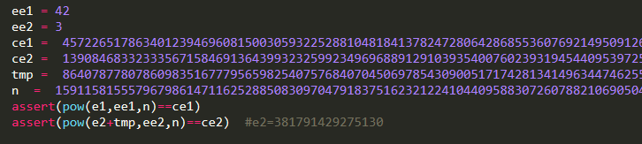
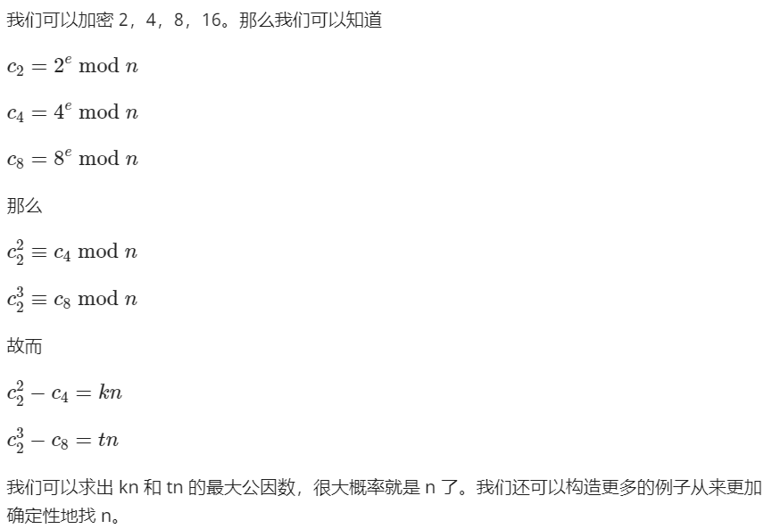

# [BUUCTF-crypto] writeup

## 数学知识

### 离散对数


### 数论

#### 费马定理

$$
m^{p-1} = 1 mod p (p为素数)
$$


#### 欧拉公式


#### 欧几里得算法


#### 扩展欧几里得


#### 中国剩余定理


### 群论


## 数学


### [WUSTCTF2020]大数计算


Note：理解问题，题目说要十六进制，前8位不知道是取十进制的前八位然后转换还是取十六进制的前八位，所以（错误就得多试试

```python
a = math.factorial(2020)
print(a)
print(hex(int(str(a)[:8])))

x = pow(520,1314) + pow(2333,666)
print(x)
print(hex(int(str(x)[:8])))
```

宇宙终极问题：x³＋y³＋z³＝42

(-80538738812075974)³ + 80435758145817515³ + 12602123297335631³ = 42

part-4，简单的积分，计算面积即可，再加36得520


## 编码

### 鸡藤椒盐味  【汉明码】

设将要进行检测的二进制代码为n位，为使其具有纠错能力，需要再加上k位的检测位，组成n+k位的代码。那么，新增加的检测位数k应满足：

2k≥n+k+1或2k-1≥n+k


## 古典

### [UTCTF2020]basic-crypto

打开文件是二进制形式，先转十六进制，再转ASCII试试


提示很明显base64


提示移位以及Roman，试试凯撒


提示进行词频分析


### 达芬奇密码 【换位】

根据电影简介，看到斐波那契数列

观察给出的一列数字，为32位，flag也是32位，

写一个函数，输出32个斐波那契数列的数

```python
def fib(n):
    if n == 0 or n == 1:
        return 1
    return fib(n-1) + fib(n-2)

for i in range(50):
    print(fib(i),end=' ')
```


原文flag通过移位得到密文c

第0位均为1，位置不变

原fib数列的233（12位）变换到第1位

因此只需要找到f在原数列哪个位置，再把c对应的数字放回原位即可，注意有两个1，而第0位不变，因此可以把第0位修改为0或其他没有冲突的数字

```python
fib = "0 1 2 3 5 8 13 21 34 55 89 144 233 377 610 987 1597 2584 4181 6765 10946 17711 28657 46368 75025 121393 196418 317811 514229 832040 1346269 2178309"

f = "0 233 3 2584 1346269 144 5 196418 21 1597 610 377 10946 89 514229 987 8 55 6765 2178309 121393 317811 46368 4181 1 832040 2 28657 75025 34 13 17711"

c = "36968853882116725547342176952286"

m = ['3']*32

fib = fib.split(' ')
f = f.split(' ')

for i in range(len(f)):
    m[fib.index(f[i])] = c[i]
for i in m:
    print(i,end='')
```

### ?[UTCTF2020]hill

未知密钥，猜测

```python
s='wznqcaduqopfkqnwofDbzgeu'
#未给密钥的自己猜测
flag_pre='utflag'
def getit(a1,b1,c1,a2,b2,c2,a3,b3,c3):
    for i in range(26):
        for j in range(26):
            if (a1 * i + b1 * j) % 26 == c1 and (a2 * i + b2 * j) % 26 == c2 and (a3 * i+b3*j) % 26 == c3:
                return (i,j)
x1=getit(22,25,20,13,16,5,2,0,0)
x2=getit(22,25,19,13,16,11,2,0,6)
import string
flag=''
for i in range(0, len(s),2):
    flag+=string.ascii_letters[(x1[0]*string.ascii_letters.index(s[i])+x1[1]*string.ascii_letters.index(s[i+1]))%26]
    flag+=string.ascii_letters[(x2[0]*string.ascii_letters.index(s[i])+x2[1]*string.ascii_letters.index(s[i+1]))%26]
print(flag)
```


## 现代

### [ACTF新生赛2020]crypto-aes

因为

```python
key=os.urandom(2)*16
iv=os.urandom(16)
```

key是**32bytes**,**256bits** ；iv是**16bytes ,128bits**

由于os.urandom（size） 

参数： size:字符串随机字节的大小 返回值：该方法返回一个字符串，该字符串表示适合加密使用的随机字节。

所以可以根据key的高128位得到key值，低128位和结果异或便得到iv

最后进行解密即可

```python
from Crypto.Cipher import AES
import os
from gmpy2 import*
from Crypto.Util.number import*

xor = 91144196586662942563895769614300232343026691029427747065707381728622849079757
enc_flag = b'\x8c-\xcd\xde\xa7\xe9\x7f.b\x8aKs\xf1\xba\xc75\xc4d\x13\x07\xac\xa4&\xd6\x91\xfe\xf3\x14\x10|\xf8p'
out = long_to_bytes(xor)
print(out)
key = out[:16]*2
print(key)
iv = bytes_to_long(key[16:])^bytes_to_long(out[16:])
print(iv)
iv = long_to_bytes(iv)
print(iv)
aes = AES.new(key,AES.MODE_CBC,iv)
flag = aes.decrypt(enc_flag)
print(flag)
```


### [AFCTF2018]你听过一次一密么？

一次一密（One-Time-Pad）：xor key  明文多长，密文就多长（适合少量明文消息）

Many-Time-Pad攻击：多个明文异或同样的key

https://www.ruanx.net/many-time-pad/

攻击思想：对于每一条密文Ci，拿去异或其他所有密文。然后去数每一列有多少个英文字符，作为“Mi在这一位是空格”的评分。依据评分从大到小排序，依次利用 “某个明文的某一位是空格” 这种信息恢复出所有明文的那一列。如果产生冲突，则舍弃掉评分小的


**修复语句太绝了**


### 秘密共享的门限方案

秘密共享的思想是将秘密以适当的方式拆分，拆分后的每一个份额由不同的参与者管理，单个参与者无法恢复秘密信息，只有若干个参与者一同协作才能恢复秘密消息。更重要的是，当其中任何相应范围内参与者出问题时，秘密仍可以完整恢复。

秘密共享是一种将秘密分割存储的密码技术，目的是阻止秘密过于集中，以达到分散风险和容忍入侵的目的，是信息安全和数据保密中的重要手段

#### ？[AFCTF2018]花开藏宝地【bloom方案】

https://webencrypt.org/secretsharing/#bloom

http://www.matrix67.com/blog/archives/1261

```python
a1 =100459779913520540098065407420629954816677926423356769524759072632219106155849450125185205557491138357760494272691949199099803239098119602186117878931534968435982565071570831032814288620974807498206233914826253433847572703407678712965098320122549759579566316372220959610814573945698083909575005303253205653244238542300266460559790606278310650849881421791081944960157781855164700773081375247
d1 =347051559622463144539669950096658163425646411435797691973701513725701575100810446175849424000000075855070430240507732735393411493866540572679626172742301366146501862670272443070970511943485865887494229487420503750457974262802053722093905126235340380261828593508455621667309946361705530667957484731929151875527489478449361198648310684702574627199321092927111137398333029697068474762820820091
a2 =305345133911395218573790903508296238659147802274031796643017539011648802808763162902335644195648525375518941848430114497150082025133000033835083076541927530829557051524161069423494451667848236452337271862085346869364976989047180532167560796470067549915390773271207901537847213882479997325575278672917648417868759077150999044891099206133296336190476413164240995177077671480352739572539631359
d2 =347051559622463144539669950096658163425646411435797691973701513725701575100810446175849424000000075855070430240507732735393411493866540572679626172742301366146501862670272443070970511943485865887494229487420503750457974262802053722093905126235340380261828593508455621667309946361705530667957484731929151875527489478449361198648310684702574627199321092927111137398333029697068474762820813413
a3 = 152012681270682340051690627924586232702552460810030322267827401771304907469802591861912921281833890613186317787813611372838066924894691892444503039545946728621696590087591246339208248647926966446848123290344911662916758039134817404720512465817867255277476717353439505243247568126193361558042940352204093381260402400739429050280526212446967632582771424597203000629197487733610187359662268583
d3 =347051559622463144539669950096658163425646411435797691973701513725701575100810446175849424000000075855070430240507732735393411493866540572679626172742301366146501862670272443070970511943485865887494229487420503750457974262802053722093905126235340380261828593508455621667309946361705530667957484731929151875527489478449361198648310684702574627199321092927111137398333029697068474762820818553

dd = d1*d2*d3
t1 = pow(dd//d1,d1-2,d1)
assert(t1*d2*d3%d1 == 1)
t2 = pow(dd//d2,d2-2,d2)
assert(t2*d1*d3%d2 == 1)
t3 = pow(dd//d3,d3-2,d3)
assert(t3*d2*d1%d3 == 1)
s = a1*t1*d2*d3+a2*t2*d1*d3+a3*t3*d1*d2
p = 80804238007977405688648566160504278593148666302626415149704905628622876270862865768337953835725801963142685182510812938072115996355782396318303927020705623120652014080032809421180400984242061592520733710243483947230962631945045134540159517488288781666622635328316972979183761952842010806304748313326215619695085380586052550443025074501971925005072999275628549710915357400946408857
s %= dd
# print(hex(s))
s %= p
s = hex(s)[2:]
flag = list(bytearray.fromhex(s))
for i in flag:
    print(chr(i),end="")
```


### RSA

#### [HDCTF2019]together  【多文件共模攻击】

先分别分析两个公钥文件

```python
with open("pubkey2.pem",'rb') as f:
    pub = RSA.importKey(f.read())
    n = pub.n
    e = pub.e
    print(n,'\n',e)
```

发现n相同，e不同。可以利用共模攻击。读取myflag文件后需要base64解码

```python
e1 = 2333
e2 = 23333
n = 14853081277902411240991719582265437298941606850989432655928075747449227799832389574251190347654658701773951599098366248661597113015221566041305501996451638624389417055956926238595947885740084994809382932733556986107653499144588614105694518150594105711438983069306254763078820574239989253573144558449346681620784979079971559976102366527270867527423001083169127402157598183442923364480383742653117285643026319914244072975557200353546060352744263637867557162046429886176035616570590229646013789737629785488326501654202429466891022723268768841320111152381619260637023031430545168618446134188815113100443559425057634959299
with open('myflag1','rb') as f:
    c1 = base64.b64decode(f.read())
    print(c1)
with open('myflag2','rb') as f:
    c2 = base64.b64decode(f.read())
    print(c2)
gcd,s,t = gmpy2.gcdext(e1,e2)
c1 = libnum.s2n(c1)
c2 = libnum.s2n(c2)
if s < 0:
    s = -s
    c1 = gmpy2.invert(c1,n)
if t < 0:
    t = -t
    c2 = gmpy2.invert(c2,n)

M = gmpy2.powmod(c1,s,n)*gmpy2.powmod(c2,t,n) % n
m = hex(M)
print(m)
print(codecs.decode(m[2:],'hex'))
m = m[2:]
missing_padding = 4 - len(m) % 4
if missing_padding:
    m += '=' * missing_padding
print(base64.b64decode(m))
```


#### [MRCTF2020]babyRSA 【数学计算】

看脚本


过程都是和rsa一样，因此得到p，q即可正常解密


生成p的方式中间有的和rsa类似，因此类比，phi为(P[i]-1)乘积

```python
P = [0 for i in range(17)]
P[9] = 206027926847308612719677572554991143421
n = 206027926847308612719677572554991143421
phi = 206027926847308612719677572554991143420
c = 213671742765908980787116579976289600595864704574134469173111790965233629909513884704158446946409910475727584342641848597858942209151114627306286393390259700239698869487469080881267182803062488043469138252786381822646126962323295676431679988602406971858136496624861228526070581338082202663895710929460596143281673761666804565161435963957655012011051936180536581488499059517946308650135300428672486819645279969693519039407892941672784362868653243632727928279698588177694171797254644864554162848696210763681197279758130811723700154618280764123396312330032986093579531909363210692564988076206283296967165522152288770019720928264542910922693728918198338839
for i in range(10,17):
    P[i] = sympy.nextprime(P[i-1])
    print(i, P[i])
    n*= P[i]
    phi *= P[i]-1
for i in range(8,0,-1):
    P[i] = sympy.prevprime(P[i+1])
    print(i,P[i])
    n *= P[i]
    phi *= P[i]-1
print(n)
e = 65537
d = gmpy2.invert(e,phi)
p = pow(c,d,n)
print(p)
print(sympy.nextprime(p))
```

q直接根据计算即可

```
q = pow(sub_q,q2,q1)
```

#### [De1CTF2019]babyrsa 【综合】

依次分析所需要的参数


根据中国剩余定理求得p^4，开四次方求得p为

```python
from sympy.ntheory.modular import crt
m = [
    20129615352491765499340112943188317180548761597861300847305827141510465619670536844634558246439230371658836928103063432870245707180355907194284861510906071265352409579441048101084995923962148527097370705452070577098780246282820065573711015664291991372085157016901209114191068574208680397710042842835940428451949500607613634682684113208766694028789275748528254287705759528498986306494267817198340658241873024800336013946294891687591013414935237821291805123285905335762719823771647853378892868896078424572232934360940672962436849523915563328779942134504499568866135266628078485232098208237036724121481835035731201383423,
    31221650155627849964466413749414700613823841060149524451234901677160009099014018926581094879840097248543411980533066831976617023676225625067854003317018794041723612556008471579060428898117790587991055681380408263382761841625714415879087478072771968160384909919958010983669368360788505288855946124159513118847747998656422521414980295212646675850690937883764000571667574381419144372824211798018586804674824564606122592483286575800685232128273820087791811663878057827386379787882962763290066072231248814920468264741654086011072638211075445447843691049847262485759393290853117072868406861840793895816215956869523289231421,
    29944537515397953361520922774124192605524711306753835303703478890414163510777460559798334313021216389356251874917792007638299225821018849648520673813786772452822809546571129816310207232883239771324122884804993418958309460009406342872173189008449237959577469114158991202433476710581356243815713762802478454390273808377430685157110095496727966308001254107517967559384019734279861840997239176254236069001453544559786063915970071130087811123912044312219535513880663913831358790376650439083660611831156205113873793106880255882114422025746986403355066996567909581710647746463994280444700922867397754748628425967488232530303,
    25703437855600135215185778453583925446912731661604054184163883272265503323016295700357253105301146726667897497435532579974951478354570415554221401778536104737296154316056314039449116386494323668483749833147800557403368489542273169489080222009368903993658498263905567516798684211462607069796613434661148186901892016282065916190920443378756167250809872483501712225782004396969996983057423942607174314132598421269169722518224478248836881076484639837343079324636997145199835034833367743079935361276149990997875905313642775214486046381368619638551892292787783137622261433528915269333426768947358552919740901860982679180791]
r = [
    19131432661217908470262338421299691998526157790583544156741981238822158563988520225986915234570037383888112724408392918113942721994125505014727545946133307329781747600302829588248042922635714391033431930411180545085316438084317927348705241927570432757892985091396044950085462429575440060652967253845041398399648442340042970814415571904057667028157512971079384601724816308078631844480110201787343583073815186771790477712040051157180318804422120472007636722063989315320863580631330647116993819777750684150950416298085261478841177681677867236865666207391847046483954029213495373613490690687473081930148461830425717614569,
    15341898433226638235160072029875733826956799982958107910250055958334922460202554924743144122170018355117452459472017133614642242411479849369061482860570279863692425621526056862808425135267608544855833358314071200687340442512856575278712986641573012456729402660597339609443771145347181268285050728925993518704899005416187250003304581230701444705157412790787027926810710998646191467130550713600765898234392350153965811595060656753711278308005193370936296124790772689433773414703645703910742193898471800081321469055211709339846392500706523670145259024267858368216902176489814789679472227343363035428541915118378163012031,
    18715065071648040017967211297231106538139985087685358555650567057715550586464814763683688299037897182845007578571401359061213777645114414642903077003568155508465819628553747173244235936586812445440095450755154357646737087071605811984163416590278352605433362327949048243722556262979909488202442530307505819371594747936223835233586945423522256938701002370646382097846105014981763307729234675737702252155130837154876831885888669150418885088089324534892506199724486783446267336789872782137895552509353583305880144947714110009893134162185382309992604435664777436197587312317224862723813510974493087450281755452428746194446,
    2282284561224858293138480447463319262474918847630148770112472703128549032592187797289965592615199709857879008271766433462032328498580340968871260189669707518557157836592424973257334362931639831072584824103123486522582531666152363874396482744561758133655406410364442174983227005501860927820871260711861008830120617056883514525798709601744088135999465598338635794275123149165498933580159945032363880613524921913023341209439657145962332213468573402863796920571812418200814817086234262280338221161622789516829363805084715652121739036183264026120868756523770196284142271849879003202190966150390061195469351716819539183797]

a = crt(m,r)
print(a[0])
print(gmpy2.mpz(pow(a[0],1/4)))
```

109935857933867829728985398563235455481120300859311421762540858762721955038310117609456763338082237907005937380873151279351831600225270995344096532750271070807051984097524900957809427861441436796934012393707770012556604479065826879107677002380580866325868240270494148512743861326447181476633546419262340100453



可以根据小公钥指数加密（m^e<n 相对而言）

解出e2=381791429275130

e1 = 15218928658178


分解n

q1p即q1为127587319253436643569312142058559706815497211661083866592534217079310497260365307426095661281103710042392775453866174657404985539066741684196020137840472950102380232067786400322600902938984916355631714439668326671310160916766472897536055371474076089779472372913037040153356437528808922911484049460342088834871

得到hint为

**orz...you.found.me.but.sorry.no.hint...keep.on.and.enjoy.it!**

最后，根据给出的条件看，一般情况用一个式子即可求解，但是报错无法求逆元d。发现gcd(e1,(p-1)(q1-1))=14。因此需要进行变形
$$
c1=m^{e1}\ mod\ (p*q1)=(m^{14})^{e1\div14}\mod\ (p*q1)
$$
可以在此条件下求出m14 的通解(显然最小特解很大可能不是答案,因为这个解还需要满足第二个方程)

第二个方程同理，用中国剩余定理求得m^14

将同余方程组进行细化

m^14 ☰a1 mod p
m^14 ☰ a1 mod q1
m^14 ☰ a2 mod p
m^14 ☰ a2 mod q2

由于m的指数过大,我们尝试通过构造一个新的rsa式子来降解m的指数.理论上4个方程有6种合并方式.但是通过计算**gcd(p-1,7)!=1**所以如果选择p的话显然是行不通的.于是舍弃p,选择q1,q2进行合并.得到一个全新的方程以后再通过一般求解rsa的方法就可以了

m^14 = (m^2)^7 mod (q1*q2)

看作新的rsa，e为7，c为之前求得m^14，最后求得m^2，再分解即可

#### [NPUCTF2020]认清形势，建立信心【选择明文攻击】




## ELgamal


## Hash


## 脑洞

