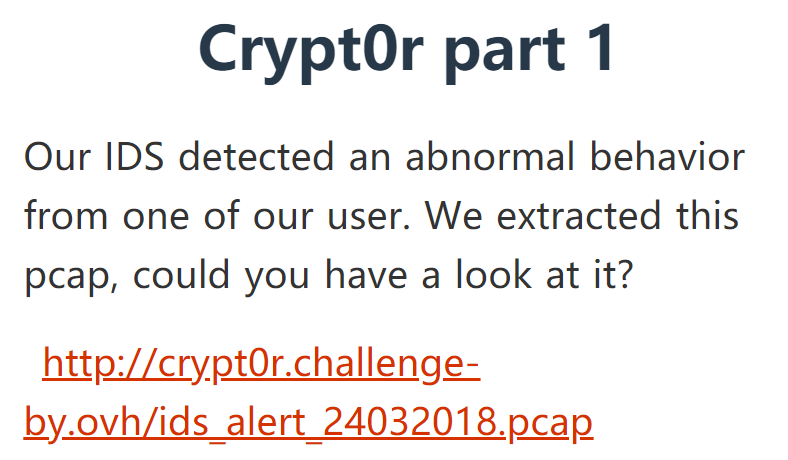
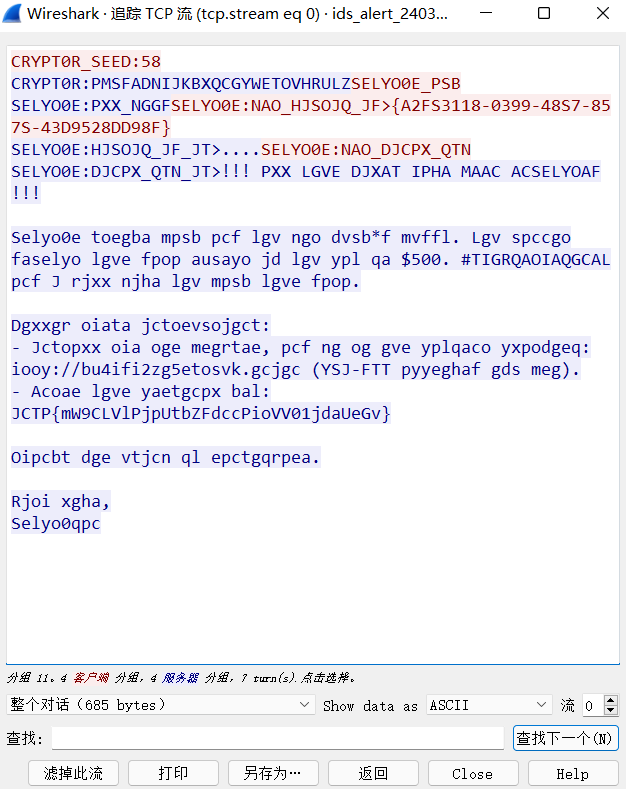
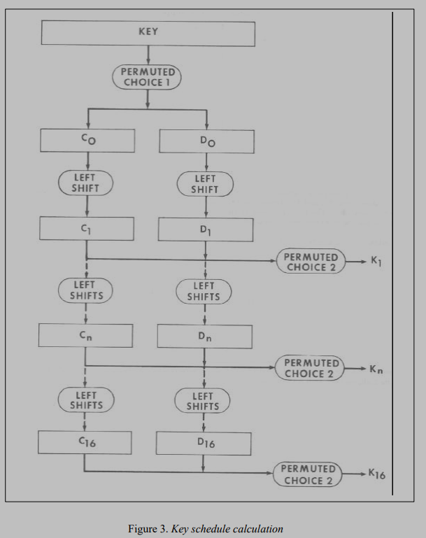
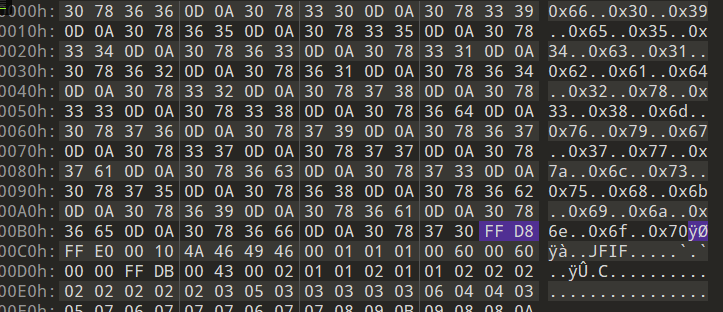
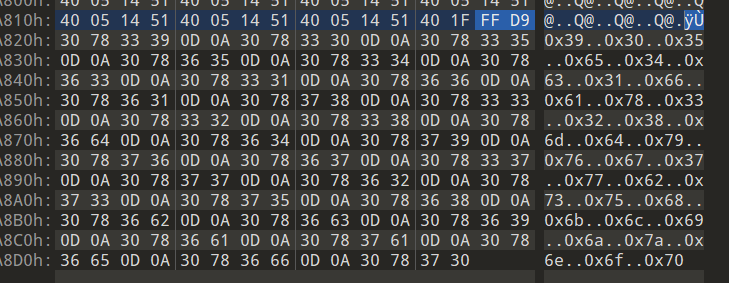

#  [BUUCTF-crypto] writeup

## 数学知识

## 

### 连分数

数x表示为如下形式


可以
$$
x=[a 
0
​
 ,a 
1
​
 ,a 
2
​
 ,a 
3
​
 ,…,a 
n
​
 ]
$$
例子：


```python
        def continuedfra(x,y):
            cf = []
            while y:
                cf += [x//y]
                x,y = y,x%y
            return cf

        n = continuedfra(73,95)
        print(n)
```


### 离散对数

n1=p1q1，则ord(p1)=q1，因为
$$
p1^x mod n 
$$
的值只有q1种结果

### 数论

#### 费马定理


$$
m^{p-1} = 1 mod p (p为素数)
$$

#### 欧拉函数


#### 欧拉准则

给定非零n，**奇素数p**

n有一个平方根（二次余数）当且仅当
$$
n^{p-1/2} = 1 (mod\ p)
$$
若n没有平方根
$$
n^{p-1/2} = -1 (mod\ p)
$$

可以通过此判断n是否为p的二次剩余

#### 欧几里得算法


#### 扩展欧几里得


#### 中国剩余定理


### 抽象代数


## 数学

### [WUSTCTF2020]大数计算


Note：理解问题，题目说要十六进制，前8位不知道是取十进制的前八位然后转换还是取十六进制的前八位，所以（错误就得多试试

```python
a = math.factorial(2020)
print(a)
print(hex(int(str(a)[:8])))

x = pow(520,1314) + pow(2333,666)
print(x)
print(hex(int(str(x)[:8])))
```

宇宙终极问题：x³＋y³＋z³＝42

(-80538738812075974)³ + 80435758145817515³ + 12602123297335631³ = 42

part-4，简单的积分，计算面积即可，再加36得520


## 编码

### 鸡藤椒盐味  【汉明码】

设将要进行检测的二进制代码为n位，为使其具有纠错能力，需要再加上k位的检测位，组成n+k位的代码。那么，新增加的检测位数k应满足：

2k≥n+k+1或2k-1≥n+k


## 古典

### [INSHack2018]Crypt0r part 1【tcp流+简单替换】



给出pcap文件

使用wireshark打开，并分析tcp数据流



quipquip直接频率分析得到的结果不太对，再仔细观察可能用到的为第二行中的

```python
def replacement(s,cipher):
    # s为m中对应的字母
    m = 'ABCDEFGHIJKLMNOPQRSTUVWXYZabcdefghijklmnopqrstuvwxyz'
    x = string.ascii_letters.maketrans(s, m)
    print(cipher.translate(x))
    
s = 'PMSFADNIJKBXQCGYWETOVHRULZ'
s += s.lower()
replacement()
```

### [UTCTF2020]basic-crypto

打开文件是二进制形式，先转十六进制，再转ASCII试试


提示很明显base64


提示移位以及Roman，试试凯撒


提示进行词频分析


### 达芬奇密码 【换位】

根据电影简介，看到斐波那契数列

观察给出的一列数字，为32位，flag也是32位，

写一个函数，输出32个斐波那契数列的数

```python
def fib(n):
    if n == 0 or n == 1:
        return 1
    return fib(n-1) + fib(n-2)

for i in range(50):
    print(fib(i),end=' ')
```


原文flag通过移位得到密文c

第0位均为1，位置不变

原fib数列的233（12位）变换到第1位

因此只需要找到f在原数列哪个位置，再把c对应的数字放回原位即可，注意有两个1，而第0位不变，因此可以把第0位修改为0或其他没有冲突的数字

```python
fib = "0 1 2 3 5 8 13 21 34 55 89 144 233 377 610 987 1597 2584 4181 6765 10946 17711 28657 46368 75025 121393 196418 317811 514229 832040 1346269 2178309"

f = "0 233 3 2584 1346269 144 5 196418 21 1597 610 377 10946 89 514229 987 8 55 6765 2178309 121393 317811 46368 4181 1 832040 2 28657 75025 34 13 17711"

c = "36968853882116725547342176952286"

m = ['3']*32

fib = fib.split(' ')
f = f.split(' ')

for i in range(len(f)):
    m[fib.index(f[i])] = c[i]
for i in m:
    print(i,end='')
```

### ?[UTCTF2020]hill

未知密钥，猜测

```python
s='wznqcaduqopfkqnwofDbzgeu'
#未给密钥的自己猜测
flag_pre='utflag'
def getit(a1,b1,c1,a2,b2,c2,a3,b3,c3):
    for i in range(26):
        for j in range(26):
            if (a1 * i + b1 * j) % 26 == c1 and (a2 * i + b2 * j) % 26 == c2 and (a3 * i+b3*j) % 26 == c3:
                return (i,j)
x1=getit(22,25,20,13,16,5,2,0,0)
x2=getit(22,25,19,13,16,11,2,0,6)
import string
flag=''
for i in range(0, len(s),2):
    flag+=string.ascii_letters[(x1[0]*string.ascii_letters.index(s[i])+x1[1]*string.ascii_letters.index(s[i+1]))%26]
    flag+=string.ascii_letters[(x2[0]*string.ascii_letters.index(s[i])+x2[1]*string.ascii_letters.index(s[i+1]))%26]
print(flag)
```

### [XNUCA2018]baby_crypto【重合指数、词频分析】

题目:26个字母用0-25分别表示，有两串密钥，长度未知，然后一个用作乘数，一个用作加数对明文进行加密


https://blog.csdn.net/weixin_44110537/article/details/107947158


## 块密码

### [ACTF新生赛2020]crypto-aes

因为

```python
key=os.urandom(2)*16
iv=os.urandom(16)
```

key是**32bytes**,**256bits** ；iv是**16bytes ,128bits**

由于os.urandom（size） 

参数： size:字符串随机字节的大小 返回值：该方法返回一个字符串，该字符串表示适合加密使用的随机字节。

所以可以根据key的高128位得到key值，低128位和结果异或便得到iv

最后进行解密即可

```python
from Crypto.Cipher import AES
import os
from gmpy2 import*
from Crypto.Util.number import*

xor = 91144196586662942563895769614300232343026691029427747065707381728622849079757
enc_flag = b'\x8c-\xcd\xde\xa7\xe9\x7f.b\x8aKs\xf1\xba\xc75\xc4d\x13\x07\xac\xa4&\xd6\x91\xfe\xf3\x14\x10|\xf8p'
out = long_to_bytes(xor)
print(out)
key = out[:16]*2
print(key)
iv = bytes_to_long(key[16:])^bytes_to_long(out[16:])
print(iv)
iv = long_to_bytes(iv)
print(iv)
aes = AES.new(key,AES.MODE_CBC,iv)
flag = aes.decrypt(enc_flag)
print(flag)
```

### [AFCTF2018]MyOwnCBC【AES-CBC】

加密过程是用上一级的密文，作为下一次加密的密钥key,所以初始密钥key可以知道就是题目给的密文前32个


### [美团CTF]


### [ACTF新生赛2020]crypto-des

c语言中数据在内存中的存储（大小端）


有轮密钥，直接解密即可


### [NCTF2019]reverse【DES-Kn泄露】

#### 题目

```python
import os
import pyDes


flag = "NCTF{******************************************}"
key = os.urandom(8)

d = pyDes.des(key)
cipher = d.encrypt(flag.encode())

with open('cipher', 'wb') as f:
    f.write(cipher)


# Leak: d.Kn[10] == [0, 1, 0, 0, 0, 1, 0, 1, 0, 1, 1, 0, 1, 1, 0, 1, 1, 0, 1, 0, 1, 0, 1, 0, 1, 0, 1, 0, 1, 0, 1, 0, 0, 0, 0, 1, 0, 0, 1, 0, 0, 0, 1, 0, 0, 0, 0, 1]
```

Pydes中的DES，泄露了Kn[10]


#### 思路

根据https://csrc.nist.gov/csrc/media/publications/fips/46/3/archive/1999-10-25/documents/fips46-3.pdf，泄露出的Kn[10]为第11组子密钥K11

`PERMUTED CHOICE 2`是一个56 bits -> 48 bits的置换。可以穷举被truncated的8bits，逆一下对K11的`PERMUTED CHOICE 2`即可返回到`C11 D11`。

再沿着那个长流程顺下去（`Ci`, `Di`经过16次`LEFT SHIFTS`后会复原），就可以恢复出所有子密钥。



https://blog.soreatu.com/posts/intended-solution-to-crypto-problems-in-nctf-2019/#reverse909pt-2solvers


## 秘密共享的门限方案

秘密共享的思想是将秘密以适当的方式拆分，拆分后的每一个份额由不同的参与者管理，单个参与者无法恢复秘密信息，只有若干个参与者一同协作才能恢复秘密消息。更重要的是，当其中任何相应范围内参与者出问题时，秘密仍可以完整恢复。

秘密共享是一种将秘密分割存储的密码技术，目的是阻止秘密过于集中，以达到分散风险和容忍入侵的目的，是信息安全和数据保密中的重要手段

### ？[AFCTF2018]花开藏宝地【bloom方案】

https://webencrypt.org/secretsharing/#bloom

http://www.matrix67.com/blog/archives/1261

```python
a1 =100459779913520540098065407420629954816677926423356769524759072632219106155849450125185205557491138357760494272691949199099803239098119602186117878931534968435982565071570831032814288620974807498206233914826253433847572703407678712965098320122549759579566316372220959610814573945698083909575005303253205653244238542300266460559790606278310650849881421791081944960157781855164700773081375247
d1 =347051559622463144539669950096658163425646411435797691973701513725701575100810446175849424000000075855070430240507732735393411493866540572679626172742301366146501862670272443070970511943485865887494229487420503750457974262802053722093905126235340380261828593508455621667309946361705530667957484731929151875527489478449361198648310684702574627199321092927111137398333029697068474762820820091
a2 =305345133911395218573790903508296238659147802274031796643017539011648802808763162902335644195648525375518941848430114497150082025133000033835083076541927530829557051524161069423494451667848236452337271862085346869364976989047180532167560796470067549915390773271207901537847213882479997325575278672917648417868759077150999044891099206133296336190476413164240995177077671480352739572539631359
d2 =347051559622463144539669950096658163425646411435797691973701513725701575100810446175849424000000075855070430240507732735393411493866540572679626172742301366146501862670272443070970511943485865887494229487420503750457974262802053722093905126235340380261828593508455621667309946361705530667957484731929151875527489478449361198648310684702574627199321092927111137398333029697068474762820813413
a3 = 152012681270682340051690627924586232702552460810030322267827401771304907469802591861912921281833890613186317787813611372838066924894691892444503039545946728621696590087591246339208248647926966446848123290344911662916758039134817404720512465817867255277476717353439505243247568126193361558042940352204093381260402400739429050280526212446967632582771424597203000629197487733610187359662268583
d3 =347051559622463144539669950096658163425646411435797691973701513725701575100810446175849424000000075855070430240507732735393411493866540572679626172742301366146501862670272443070970511943485865887494229487420503750457974262802053722093905126235340380261828593508455621667309946361705530667957484731929151875527489478449361198648310684702574627199321092927111137398333029697068474762820818553

dd = d1*d2*d3
t1 = pow(dd//d1,d1-2,d1)
assert(t1*d2*d3%d1 == 1)
t2 = pow(dd//d2,d2-2,d2)
assert(t2*d1*d3%d2 == 1)
t3 = pow(dd//d3,d3-2,d3)
assert(t3*d2*d1%d3 == 1)
s = a1*t1*d2*d3+a2*t2*d1*d3+a3*t3*d1*d2
p = 80804238007977405688648566160504278593148666302626415149704905628622876270862865768337953835725801963142685182510812938072115996355782396318303927020705623120652014080032809421180400984242061592520733710243483947230962631945045134540159517488288781666622635328316972979183761952842010806304748313326215619695085380586052550443025074501971925005072999275628549710915357400946408857
s %= dd
# print(hex(s))
s %= p
s = hex(s)[2:]
flag = list(bytearray.fromhex(s))
for i in flag:
    print(chr(i),end="")
```


## ELgamal


## Hash


## ???

### Left or Right【二叉树】

#### 题目

Left?Middle?No，I want right！（flag is right？！）

一个无法打开的jpg文件


#### 思路

无法打开，可能和文件头尾有关，查找jpg文件头尾

https://blog.csdn.net/xiangshangbashaonian/article/details/80156865

文件头FFD8，前面有一段冗余信息



文件尾FFD9，后面也有一段冗余信息，先分别去掉，然后另存为图片，发现是一个二叉树图片




发现都是十六进制，且好像基本一致，转化为字符串分别为

```python
left = "f09e54c1bad2x38mvyg7wzlsuhkijnop"
middle = "905e4c1fax328mdyvg7wbsuhklijznop"
```

根据题目，可能分别为前序遍历，中序遍历的结果，最后根据这个求后序遍历即为flag

```python
left = "f09e54c1bad2x38mvyg7wzlsuhkijnop"
middle = "905e4c1fax328mdyvg7wbsuhklijznop"
las = ""

def LM2Last(middle):
    global left
    global las
    root = left[0]
    left = left[1:]
    root_po = middle.find(root)
    l = middle[0:root_po]
    r = middle[root_po+1:len(middle)]
    if len(l) > 0:
        LM2Last(l)
    if len(r) > 0:
        LM2Last(r)
    las += root


if __name__ == "__main__":
    LM2Last(middle)
    print(las)
```
