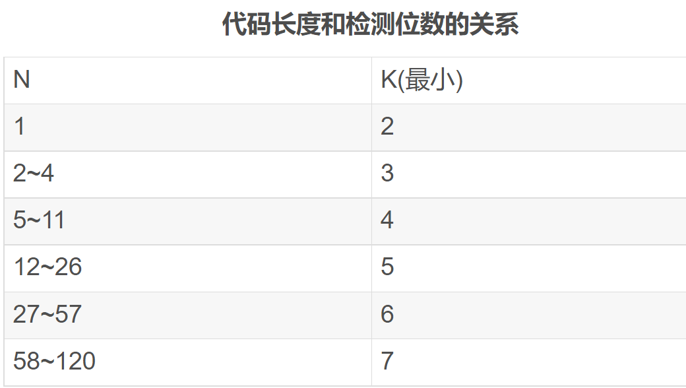
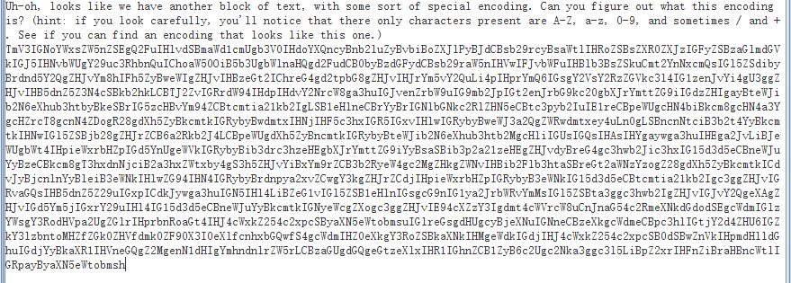
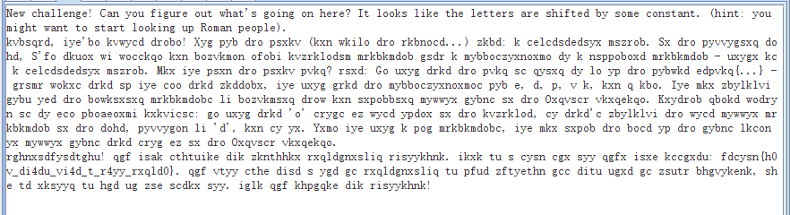
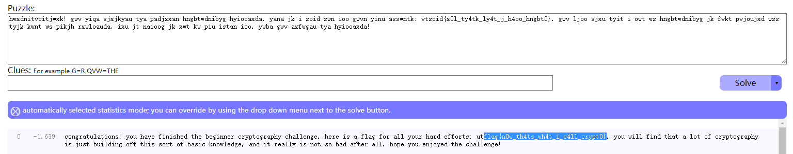
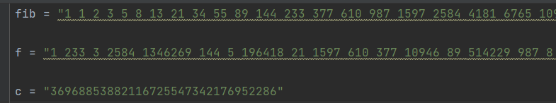
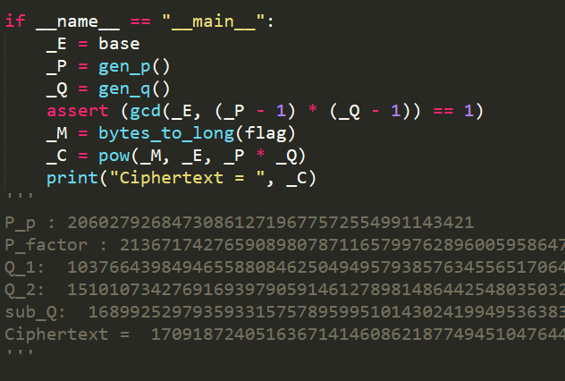

# [BUUCTF-crypto] writeup

## 数学知识

### 离散对数


### 数论

#### 费马定理


#### 欧拉公式


#### 欧几里得算法


#### 扩展欧几里得


#### 中国剩余定理


### 群论


## 数学


### [WUSTCTF2020]大数计算


Note：理解问题，题目说要十六进制，前8位不知道是取十进制的前八位然后转换还是取十六进制的前八位，所以（错误就得多试试

```python
a = math.factorial(2020)
print(a)
print(hex(int(str(a)[:8])))

x = pow(520,1314) + pow(2333,666)
print(x)
print(hex(int(str(x)[:8])))
```

宇宙终极问题：x³＋y³＋z³＝42

(-80538738812075974)³ + 80435758145817515³ + 12602123297335631³ = 42

part-4，简单的积分，计算面积即可，再加36得520


## 编码

### 鸡藤椒盐味  【汉明码】

设将要进行检测的二进制代码为n位，为使其具有纠错能力，需要再加上k位的检测位，组成n+k位的代码。那么，新增加的检测位数k应满足：

2k≥n+k+1或2k-1≥n+k




## 古典

### [UTCTF2020]basic-crypto

打开文件是二进制形式，先转十六进制，再转ASCII试试



提示很明显base64



提示移位以及Roman，试试凯撒


提示进行词频分析



### 达芬奇密码 【换位】

根据电影简介，看到斐波那契数列

观察给出的一列数字，为32位，flag也是32位，

写一个函数，输出32个斐波那契数列的数

```python
def fib(n):
    if n == 0 or n == 1:
        return 1
    return fib(n-1) + fib(n-2)

for i in range(50):
    print(fib(i),end=' ')
```



原文flag通过移位得到密文c

第0位均为1，位置不变

原fib数列的233（12位）变换到第1位

因此只需要找到f在原数列哪个位置，再把c对应的数字放回原位即可，注意有两个1，而第0位不变，因此可以把第0位修改为0或其他没有冲突的数字

```python
fib = "0 1 2 3 5 8 13 21 34 55 89 144 233 377 610 987 1597 2584 4181 6765 10946 17711 28657 46368 75025 121393 196418 317811 514229 832040 1346269 2178309"

f = "0 233 3 2584 1346269 144 5 196418 21 1597 610 377 10946 89 514229 987 8 55 6765 2178309 121393 317811 46368 4181 1 832040 2 28657 75025 34 13 17711"

c = "36968853882116725547342176952286"

m = ['3']*32

fib = fib.split(' ')
f = f.split(' ')

for i in range(len(f)):
    m[fib.index(f[i])] = c[i]
for i in m:
    print(i,end='')
```


## 现代

### [AFCTF2018]你听过一次一密么？

一次一密（One-Time-Pad）：xor key  明文多长，密文就多长（适合少量明文消息）

Many-Time-Pad攻击：多个明文异或同样的key

https://www.ruanx.net/many-time-pad/

攻击思想：对于每一条密文Ci，拿去异或其他所有密文。然后去数每一列有多少个英文字符，作为“Mi在这一位是空格”的评分。依据评分从大到小排序，依次利用 “某个明文的某一位是空格” 这种信息恢复出所有明文的那一列。如果产生冲突，则舍弃掉评分小的


**修复语句太绝了**


### RSA

#### [HDCTF2019]together  【多文件共模攻击】

先分别分析两个公钥文件

```python
with open("pubkey2.pem",'rb') as f:
    pub = RSA.importKey(f.read())
    n = pub.n
    e = pub.e
    print(n,'\n',e)
```

发现n相同，e不同。可以利用共模攻击。读取myflag文件后需要base64解码

```python
e1 = 2333
e2 = 23333
n = 14853081277902411240991719582265437298941606850989432655928075747449227799832389574251190347654658701773951599098366248661597113015221566041305501996451638624389417055956926238595947885740084994809382932733556986107653499144588614105694518150594105711438983069306254763078820574239989253573144558449346681620784979079971559976102366527270867527423001083169127402157598183442923364480383742653117285643026319914244072975557200353546060352744263637867557162046429886176035616570590229646013789737629785488326501654202429466891022723268768841320111152381619260637023031430545168618446134188815113100443559425057634959299
with open('myflag1','rb') as f:
    c1 = base64.b64decode(f.read())
    print(c1)
with open('myflag2','rb') as f:
    c2 = base64.b64decode(f.read())
    print(c2)
gcd,s,t = gmpy2.gcdext(e1,e2)
c1 = libnum.s2n(c1)
c2 = libnum.s2n(c2)
if s < 0:
    s = -s
    c1 = gmpy2.invert(c1,n)
if t < 0:
    t = -t
    c2 = gmpy2.invert(c2,n)

M = gmpy2.powmod(c1,s,n)*gmpy2.powmod(c2,t,n) % n
m = hex(M)
print(m)
print(codecs.decode(m[2:],'hex'))
m = m[2:]
missing_padding = 4 - len(m) % 4
if missing_padding:
    m += '=' * missing_padding
print(base64.b64decode(m))
```


#### [MRCTF2020]babyRSA 【数学计算】

看脚本



过程都是和rsa一样，因此得到p，q即可正常解密


生成p的方式中间有的和rsa类似，因此类比，phi为(P[i]-1)乘积

```python
P = [0 for i in range(17)]
P[9] = 206027926847308612719677572554991143421
n = 206027926847308612719677572554991143421
phi = 206027926847308612719677572554991143420
c = 213671742765908980787116579976289600595864704574134469173111790965233629909513884704158446946409910475727584342641848597858942209151114627306286393390259700239698869487469080881267182803062488043469138252786381822646126962323295676431679988602406971858136496624861228526070581338082202663895710929460596143281673761666804565161435963957655012011051936180536581488499059517946308650135300428672486819645279969693519039407892941672784362868653243632727928279698588177694171797254644864554162848696210763681197279758130811723700154618280764123396312330032986093579531909363210692564988076206283296967165522152288770019720928264542910922693728918198338839
for i in range(10,17):
    P[i] = sympy.nextprime(P[i-1])
    print(i, P[i])
    n*= P[i]
    phi *= P[i]-1
for i in range(8,0,-1):
    P[i] = sympy.prevprime(P[i+1])
    print(i,P[i])
    n *= P[i]
    phi *= P[i]-1
print(n)
e = 65537
d = gmpy2.invert(e,phi)
p = pow(c,d,n)
print(p)
print(sympy.nextprime(p))
```

q直接根据计算即可

```
q = pow(sub_q,q2,q1)
```

#### [De1CTF2019]babyrsa


## ELgamal


## Hash


## 脑洞

