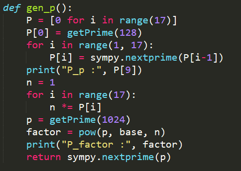
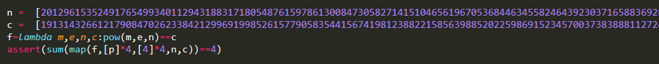
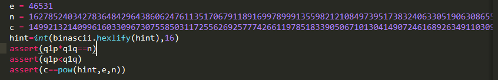
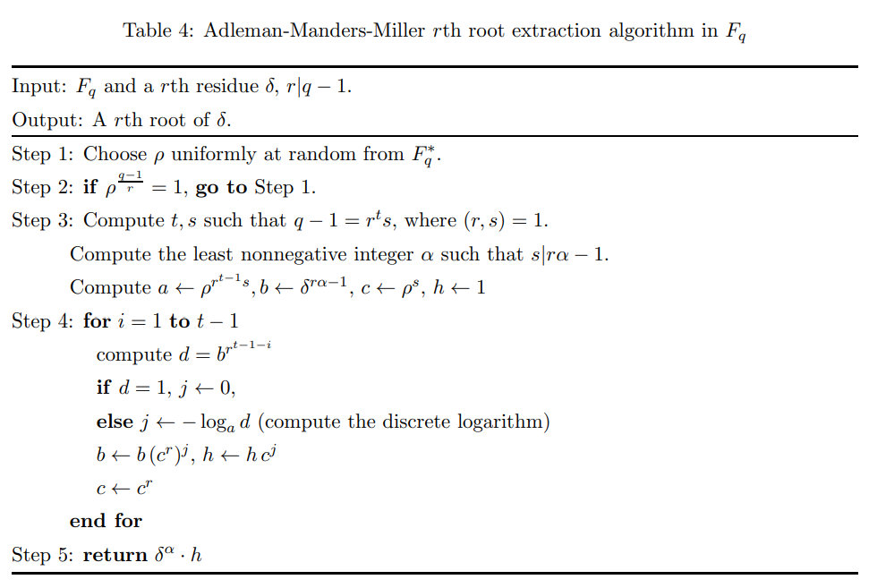

# RSA【大整数因式分解】

## [HDCTF2019]together  【多文件共模攻击】

先分别分析两个公钥文件

```python
with open("pubkey2.pem",'rb') as f:
    pub = RSA.importKey(f.read())
    n = pub.n
    e = pub.e
    print(n,'\n',e)
```

发现n相同，e不同。可以利用共模攻击。读取myflag文件后需要base64解码

```python
e1 = 2333
e2 = 23333
n = 14853081277902411240991719582265437298941606850989432655928075747449227799832389574251190347654658701773951599098366248661597113015221566041305501996451638624389417055956926238595947885740084994809382932733556986107653499144588614105694518150594105711438983069306254763078820574239989253573144558449346681620784979079971559976102366527270867527423001083169127402157598183442923364480383742653117285643026319914244072975557200353546060352744263637867557162046429886176035616570590229646013789737629785488326501654202429466891022723268768841320111152381619260637023031430545168618446134188815113100443559425057634959299
with open('myflag1','rb') as f:
    c1 = base64.b64decode(f.read())
    print(c1)
with open('myflag2','rb') as f:
    c2 = base64.b64decode(f.read())
    print(c2)
gcd,s,t = gmpy2.gcdext(e1,e2)
c1 = libnum.s2n(c1)
c2 = libnum.s2n(c2)
if s < 0:
    s = -s
    c1 = gmpy2.invert(c1,n)
if t < 0:
    t = -t
    c2 = gmpy2.invert(c2,n)

M = gmpy2.powmod(c1,s,n)*gmpy2.powmod(c2,t,n) % n
m = hex(M)
print(m)
print(codecs.decode(m[2:],'hex'))
m = m[2:]
missing_padding = 4 - len(m) % 4
if missing_padding:
    m += '=' * missing_padding
print(base64.b64decode(m))
```


## [MRCTF2020]babyRSA 【数学计算】

看脚本


过程都是和rsa一样，因此得到p，q即可正常解密



生成p的方式中间有的和rsa类似，因此类比，phi为(P[i]-1)乘积

```python
P = [0 for i in range(17)]
P[9] = 206027926847308612719677572554991143421
n = 206027926847308612719677572554991143421
phi = 206027926847308612719677572554991143420
c = 213671742765908980787116579976289600595864704574134469173111790965233629909513884704158446946409910475727584342641848597858942209151114627306286393390259700239698869487469080881267182803062488043469138252786381822646126962323295676431679988602406971858136496624861228526070581338082202663895710929460596143281673761666804565161435963957655012011051936180536581488499059517946308650135300428672486819645279969693519039407892941672784362868653243632727928279698588177694171797254644864554162848696210763681197279758130811723700154618280764123396312330032986093579531909363210692564988076206283296967165522152288770019720928264542910922693728918198338839
for i in range(10,17):
    P[i] = sympy.nextprime(P[i-1])
    print(i, P[i])
    n*= P[i]
    phi *= P[i]-1
for i in range(8,0,-1):
    P[i] = sympy.prevprime(P[i+1])
    print(i,P[i])
    n *= P[i]
    phi *= P[i]-1
print(n)
e = 65537
d = gmpy2.invert(e,phi)
p = pow(c,d,n)
print(p)
print(sympy.nextprime(p))
```

q直接根据计算即可

```
q = pow(sub_q,q2,q1)
```

## [De1CTF2019]babyrsa 【综合】

依次分析所需要的参数



根据中国剩余定理求得p^4，开四次方求得p为

```python
from sympy.ntheory.modular import crt
m = [
    20129615352491765499340112943188317180548761597861300847305827141510465619670536844634558246439230371658836928103063432870245707180355907194284861510906071265352409579441048101084995923962148527097370705452070577098780246282820065573711015664291991372085157016901209114191068574208680397710042842835940428451949500607613634682684113208766694028789275748528254287705759528498986306494267817198340658241873024800336013946294891687591013414935237821291805123285905335762719823771647853378892868896078424572232934360940672962436849523915563328779942134504499568866135266628078485232098208237036724121481835035731201383423,
    31221650155627849964466413749414700613823841060149524451234901677160009099014018926581094879840097248543411980533066831976617023676225625067854003317018794041723612556008471579060428898117790587991055681380408263382761841625714415879087478072771968160384909919958010983669368360788505288855946124159513118847747998656422521414980295212646675850690937883764000571667574381419144372824211798018586804674824564606122592483286575800685232128273820087791811663878057827386379787882962763290066072231248814920468264741654086011072638211075445447843691049847262485759393290853117072868406861840793895816215956869523289231421,
    29944537515397953361520922774124192605524711306753835303703478890414163510777460559798334313021216389356251874917792007638299225821018849648520673813786772452822809546571129816310207232883239771324122884804993418958309460009406342872173189008449237959577469114158991202433476710581356243815713762802478454390273808377430685157110095496727966308001254107517967559384019734279861840997239176254236069001453544559786063915970071130087811123912044312219535513880663913831358790376650439083660611831156205113873793106880255882114422025746986403355066996567909581710647746463994280444700922867397754748628425967488232530303,
    25703437855600135215185778453583925446912731661604054184163883272265503323016295700357253105301146726667897497435532579974951478354570415554221401778536104737296154316056314039449116386494323668483749833147800557403368489542273169489080222009368903993658498263905567516798684211462607069796613434661148186901892016282065916190920443378756167250809872483501712225782004396969996983057423942607174314132598421269169722518224478248836881076484639837343079324636997145199835034833367743079935361276149990997875905313642775214486046381368619638551892292787783137622261433528915269333426768947358552919740901860982679180791]
r = [
    19131432661217908470262338421299691998526157790583544156741981238822158563988520225986915234570037383888112724408392918113942721994125505014727545946133307329781747600302829588248042922635714391033431930411180545085316438084317927348705241927570432757892985091396044950085462429575440060652967253845041398399648442340042970814415571904057667028157512971079384601724816308078631844480110201787343583073815186771790477712040051157180318804422120472007636722063989315320863580631330647116993819777750684150950416298085261478841177681677867236865666207391847046483954029213495373613490690687473081930148461830425717614569,
    15341898433226638235160072029875733826956799982958107910250055958334922460202554924743144122170018355117452459472017133614642242411479849369061482860570279863692425621526056862808425135267608544855833358314071200687340442512856575278712986641573012456729402660597339609443771145347181268285050728925993518704899005416187250003304581230701444705157412790787027926810710998646191467130550713600765898234392350153965811595060656753711278308005193370936296124790772689433773414703645703910742193898471800081321469055211709339846392500706523670145259024267858368216902176489814789679472227343363035428541915118378163012031,
    18715065071648040017967211297231106538139985087685358555650567057715550586464814763683688299037897182845007578571401359061213777645114414642903077003568155508465819628553747173244235936586812445440095450755154357646737087071605811984163416590278352605433362327949048243722556262979909488202442530307505819371594747936223835233586945423522256938701002370646382097846105014981763307729234675737702252155130837154876831885888669150418885088089324534892506199724486783446267336789872782137895552509353583305880144947714110009893134162185382309992604435664777436197587312317224862723813510974493087450281755452428746194446,
    2282284561224858293138480447463319262474918847630148770112472703128549032592187797289965592615199709857879008271766433462032328498580340968871260189669707518557157836592424973257334362931639831072584824103123486522582531666152363874396482744561758133655406410364442174983227005501860927820871260711861008830120617056883514525798709601744088135999465598338635794275123149165498933580159945032363880613524921913023341209439657145962332213468573402863796920571812418200814817086234262280338221161622789516829363805084715652121739036183264026120868756523770196284142271849879003202190966150390061195469351716819539183797]

a = crt(m,r)
print(a[0])
print(gmpy2.mpz(pow(a[0],1/4)))
```

109935857933867829728985398563235455481120300859311421762540858762721955038310117609456763338082237907005937380873151279351831600225270995344096532750271070807051984097524900957809427861441436796934012393707770012556604479065826879107677002380580866325868240270494148512743861326447181476633546419262340100453


可以根据小公钥指数加密（m^e<n 相对而言）

解出e2=381791429275130

e1 = 15218928658178



分解n

q1p即q1为127587319253436643569312142058559706815497211661083866592534217079310497260365307426095661281103710042392775453866174657404985539066741684196020137840472950102380232067786400322600902938984916355631714439668326671310160916766472897536055371474076089779472372913037040153356437528808922911484049460342088834871

得到hint为

**orz...you.found.me.but.sorry.no.hint...keep.on.and.enjoy.it!**

最后，根据给出的条件看，一般情况用一个式子即可求解，但是报错无法求逆元d。发现gcd(e1,(p-1)(q1-1))=14。因此需要进行变形
$$
c1=m^{e1}\ mod\ (p*q1)=(m^{14})^{e1\div14}\mod\ (p*q1)
$$
可以在此条件下求出m14 的通解(显然最小特解很大可能不是答案,因为这个解还需要满足第二个方程)

第二个方程同理，用中国剩余定理求得m^14

将同余方程组进行细化

m^14 ☰a1 mod p
m^14 ☰ a1 mod q1
m^14 ☰ a2 mod p
m^14 ☰ a2 mod q2

由于m的指数过大,我们尝试通过构造一个新的rsa式子来降解m的指数.理论上4个方程有6种合并方式.但是通过计算**gcd(p-1,7)!=1**所以如果选择p的话显然是行不通的.于是舍弃p,选择q1,q2进行合并.得到一个全新的方程以后再通过一般求解rsa的方法就可以了

m^14 = (m^2)^7 mod (q1*q2)

看作新的rsa，e为7，c为之前求得m^14，最后求得m^2，再分解即可

## [NPUCTF2020]认清形势，建立信心【选择明文攻击】


## [NPUCTF2020]共模攻击 【coppersmith]

Coppersmith定理的内容为：在一个e阶的mod n多项式f(x)中，如果有一个根小于n^1/e，就可以运用一个O(log n)的算法求出这些根

task中我们可以获取的信息有：


$$
c1 = m^p\ mod\ n = m^p\ mod \ p*q
$$

$$
c2 = m^q\ mod\ n = m^q\ mod\ p*q
$$

因为p、q为素数，所以由费马定理可得：


$$
m^p ≡ m\ mod\ p
$$

$$
m^q ≡ m\ mod\ q
$$

所以，又有：

　　c1 = m + ip + xpq，可整理成 c1 = m + ip 

　　c2 = m + jq + ypq，可整理成 c2 = m + jq

因此：

　　c1 * c2 = m2 + (ip + jq)m + ijn

　　(c1 + c2)m = 2m2 + (ip+jq)m 

　　有： m2 - (c1 + c2)m + c1 * c2 = ijn ≡ 0 mod n

最终的任务就是求m的值。

```python
n=128205304743751985889679351195836799434324346996129753896234917982647254577214018524580290192396070591032007818847697193260130051396080104704981594190602854241936777324431673564677900773992273463534717009587530152480725448774018550562603894883079711995434332008363470321069097619786793617099517770260029108149
c1=96860654235275202217368130195089839608037558388884522737500611121271571335123981588807994043800468529002147570655597610639680977780779494880330669466389788497046710319213376228391138021976388925171307760030058456934898771589435836261317283743951614505136840364638706914424433566782044926111639955612412134198
c2=9566853166416448316408476072940703716510748416699965603380497338943730666656667456274146023583837768495637484138572090891246105018219222267465595710692705776272469703739932909158740030049375350999465338363044226512016686534246611049299981674236577960786526527933966681954486377462298197949323271904405241585

PR.<m> = PolynomialRing(Zmod(n))
#Zmod(n):指定模，定义界限为n的环；Z表示整数；指定模是划定这个环的界限，就是有效的数字只有从0到n，其他的都通过与n取模来保证在0～n这个范围内；Zmod代表这是一个整数域中的n模环
#ZZ：整数环；QQ：有理数环；RR：实数环；CC：复数环
#PR：只是一个指针，指向用polynomialring指定的那个环（可以使用任意字符）
#PolynomialRing：这个就是说建立多项式环
#.<m>：指定一个变量的意思（可以用任意字符）
f = m^2-(c1+c2)*m+c1*c2
x0 = f.small_roots(X=2^400)
#x的绝对边界，因为m<400bits，所以设为2^400
print(x0)
```

https://xz.aliyun.com/t/6813

coppersmith攻击总结https://www.ruanx.net/coppersmith/

## [QCTF2018]Xman-RSA

查看encryption.encrypted，看代码应该是作了一个简单的替换加密，使用quipquip进行频率分析，还原出代码（其中大写的T没有作替换）

```python
from gmpy2 import is_prime 
from os import urandom 
import base64 
def bytes_to_num(b): 
	return int(b.encode('hex'), 16) 

def num_to_bytes(n): 
	b = hex(n)[2:-1] 
	b = '0' + b if len(b)%2 == 1 else b 
	return b.decode('hex') 

def get_a_prime(l): 
	random_seed = urandom(l) 
	num = bytes_to_num(random_seed) 
	while True: 
		if is_prime(num): 
			break 
		num+=1 
	return num 

def encrypt(s, e, n): 
	p = bytes_to_num(s) 
	p = pow(p, e, n) 
	return num_to_bytes(p).encode('hex') 

def separate(n): 
	p = n % 4 
	t = (p*p) % 4 
	return t == 1 

f = open('flag.txt', 'r') 
flag = f.read() 

msg1 = "" 
msg2 = "" 
for i in range(len(flag)): 
	if separate(i): 
		msg2 += flag[i] 
	else: 
		msg1 += flag[i]

p1 = get_a_prime(128) 
p2 = get_a_prime(128) 
p3 = get_a_prime(128) 
n1 = p1*p2 
n2 = p1*p3 
e = 0x1001 
c1 = encrypt(msg1, e, n1) 
c2 = encrypt(msg2, e, n2) 
print(c1) 
print(c2) 
e1 = 0x1001 
e2 = 0x101 
p4 = get_a_prime(128) 
p5 = get_a_prime(128) 
n3 = p4*p5 
c1 = num_to_bytes(pow(n1, e1, n3)).encode('hex') 
c2 = num_to_bytes(pow(n1, e2, n3)).encode('hex') 
print(c1) 
print(c2) 
print(base64.b64encode(num_to_bytes(n2))) 
print(base64.b64encode(num_to_bytes(n3)))
```

进一步分析文件，n1中的应该是59、60行中的c1、c2，ciphertext是上面真正和flag有关的的c1、c2，最后是n2和n3

先求得n2和n3的值

```python
n2 = "PVNHb2BfGAnmxLrbKhgsYXRwWIL9eOj6K0s3I0slKHCTXTAUtZh3T0r+RoSlhpO3+77AY8P7WETYz2Jzuv5FV/mMODoFrM5fMyQsNt90VynR6J3Jv+fnPJPsm2hJ1Fqt7EKaVRwCbt6a4BdcRoHJsYN/+eh7k/X+FL5XM7viyvQxyFawQrhSV79FIoX6xfjtGW+uAeVF7DScRcl49dlwODhFD7SeLqzoYDJPIQS+VSb3YtvrDgdV+EhuS1bfWvkkXRijlJEpLrgWYmMdfsYX8u/+Ylf5xcBGn3hv1YhQrBCg77AHuUF2w/gJ/ADHFiMcH3ux3nqOsuwnbGSr7jA6Cw=="
n3 = "TmNVbWUhCXR1od3gBpM+HGMKK/4ErfIKITxomQ/QmNCZlzmmsNyPXQBiMEeUB8udO7lWjQTYGjD6k21xjThHTNDG4z6C2cNNPz73VIaNTGz0hrh6CmqDowFbyrk+rv53QSkVKPa8EZnFKwGz9B3zXimm1D+01cov7V/ZDfrHrEjsDkgK4ZlrQxPpZAPl+yqGlRK8soBKhY/PF3/GjbquRYeYKbagpUmWOhLnF4/+DP33ve/EpaSAPirZXzf8hyatL4/5tAZ0uNq9W6T4GoMG+N7aS2GeyUA2sLJMHymW4cFK5l5kUvjslRdXOHTmz5eHxqIV6TmSBQRgovUijlNamQ=="
n2 = bytes_to_long(base64.b64decode(n2))
n3 = bytes_to_long(base64.b64decode(n3))
print(n2)
print(n3)
```

然后共模攻击，求得n1的值

```python
c1 = "2639c28e3609a4a8c953cca9c326e8e062756305ae8aee6efcd346458aade3ee8c2106ab9dfe5f470804f366af738aa493fd2dc26cb249a922e121287f3eddec0ed8dea89747dc57aed7cd2089d75c23a69bf601f490a64f73f6a583081ae3a7ed52238c13a95d3322065adba9053ee5b12f1de1873dbad9fbf4a50a2f58088df0fddfe2ed8ca1118c81268c8c0fd5572494276f4e48b5eb424f116e6f5e9d66da1b6b3a8f102539b690c1636e82906a46f3c5434d5b04ed7938861f8d453908970eccef07bf13f723d6fdd26a61be8b9462d0ddfbedc91886df194ea022e56c1780aa6c76b9f1c7d5ea743dc75cec3c805324e90ea577fa396a1effdafa3090"
c2 = "42ff1157363d9cd10da64eb4382b6457ebb740dbef40ade9b24a174d0145adaa0115d86aa2fc2a41257f2b62486eaebb655925dac78dd8d13ab405aef5b8b8f9830094c712193500db49fb801e1368c73f88f6d8533c99c8e7259f8b9d1c926c47215ed327114f235ba8c873af7a0052aa2d32c52880db55c5615e5a1793b690c37efdd5e503f717bb8de716303e4d6c4116f62d81be852c5d36ef282a958d8c82cf3b458dcc8191dcc7b490f227d1562b1d57fbcf7bf4b78a5d90cd385fd79c8ca4688e7d62b3204aeaf9692ba4d4e44875eaa63642775846434f9ce51d138ca702d907849823b1e86896e4ea6223f93fae68b026cfe5fa5a665569a9e3948a"
c1 = codecs.decode(c1,'hex')
c1 = bytes_to_long(c1)
c2 = bytes_to_long(codecs.decode(c2,'hex'))
e1 = 0x1001
e2 = 0x101
n = n3
gcd,s,t = gmpy2.gcdext(e1,e2)
if s < 0:
    s = -s
    c1 = gmpy2.invert(c1,n)
if t < 0:
    t = -t
    c2 = gmpy2.invert(c2,n)

M = gmpy2.powmod(c1,s,n)*gmpy2.powmod(c2,t,n) % n
print(M)
n1 = M
```

最后求解得到msg1，msg2。再分析separate函数，发现只是交错分割flag

所以还原即可。

注意字节码需要decode()转换为字符串。

给到的函数num_to_bytes不知道为什么可能有一点小问题，最后需要改用long_to_bytes

```python
p = gmpy2.gcd(n1,n2)


def decrypt(c,e,n):
    c = bytes_to_num(codecs.decode(c,'hex'))
    q = divmod(n,p)[0]
    phi_n = (p-1)*(q-1)
    d = gmpy2.invert(e,phi_n)
    m = pow(c,d,n)

    return long_to_bytes(m)


c1 = "1240198b148089290e375b999569f0d53c32d356b2e95f5acee070f016b3bef243d0b5e46d9ad7aa7dfe2f21bda920d0ac7ce7b1e48f22b2de410c6f391ce7c4347c65ffc9704ecb3068005e9f35cbbb7b27e0f7a18f4f42ae572d77aaa3ee189418d6a07bab7d93beaa365c98349d8599eb68d21313795f380f05f5b3dfdc6272635ede1f83d308c0fdb2baf444b9ee138132d0d532c3c7e60efb25b9bf9cb62dba9833aa3706344229bd6045f0877661a073b6deef2763452d0ad7ab3404ba494b93fd6dfdf4c28e4fe83a72884a99ddf15ca030ace978f2da87b79b4f504f1d15b5b96c654f6cd5179b72ed5f84d3a16a8f0d5bf6774e7fd98d27bf3c9839"
c2 = "129d5d4ab3f9e8017d4e6761702467bbeb1b884b6c4f8ff397d078a8c41186a3d52977fa2307d5b6a0ad01fedfc3ba7b70f776ba3790a43444fb954e5afd64b1a3abeb6507cf70a5eb44678a886adf81cb4848a35afb4db7cd7818f566c7e6e2911f5ababdbdd2d4ff9825827e58d48d5466e021a64599b3e867840c07e29582961f81643df07f678a61a9f9027ebd34094e272dfbdc4619fa0ac60f0189af785df77e7ec784e086cf692a7bf7113a7fb8446a65efa8b431c6f72c14bcfa49c9b491fb1d87f2570059e0f13166a85bb555b40549f45f04bc5dbd09d8b858a5382be6497d88197ffb86381085756365bd757ec3cdfa8a77ba1728ec2de596c5ab"
e = 0x1001
msg1 = decrypt(c1,e,n1).decode()
msg2 = decrypt(c2,e,n2).decode()

print()

flag = ""
len = len(msg2) + len(msg1)
tmp1 = 0
tmp2 = 0
for i in range(len//2):
    flag += str(msg1[tmp1])
    flag += str(msg2[tmp2])
    tmp1+=1
    tmp2+=1

print(flag)
```

## [羊城杯 2020]RRRRRRRSA 【wiener attack】

wiener attack：依靠连分数进行攻击，适用于非常接近某一值（如1）时，求一个比例关系，通过该比例关系再反推关键信息。

适用于解密指数d很小，满足以下条件
$$
d < 1/3\ * N^{1/4}
\\
q < p < 2q
$$
一般用法：根据
$$
ed\ mod\ phi(n) = 1
$$
得到

$$
e*d = 1 + k*phi(n) \\
即\ e/phi(n) = k/d + 1/d*phi(n)
\\ 而\ phi(n)接近于n 
\\ e/n - k/d = 1/d*phi(n)
\\ e/n 与 k/d非常接近
\\ 
$$
而e/N又是已知的,因此对e/N进行连分数展开，得到的一串分数的分母很有可能就是d，只要检验一下 ed mod phi(n) 看它是不是1就知道对不对了。


本题特殊之处：e与N并没有近到相除约为1的地步，相差还是很大的，也就是说解密指数d也许还是很大的，这样就解不出来。但是N1和N2的关系却适合。
$$
N1/N2=(p1/p2)^2\ * (q1/q2)
$$
显然我们可以知道的是N1/N2 <Q1/Q2，所以在Q1/Q2在区间(N1/N2,1)之间，尝试对N1/N2进行连分数展开并求其各项渐进分数，其中某个连分数的分母可能就是Q1（这个可以依靠N%Q来验证）

```python
        N1 =
        N2 =
        #求连分数的项
        def continuedfra(x,y):
            cf = []
            while y:
                cf += [x//y]
                x,y = y,x%y
            return cf
        #得到分子和分母
        def simplify(c):
            numrator = 0 #分子
            denominator = 1 #分母
            for x in c[::-1]: #倒序遍历？
                numrator,denominator = denominator,x * denominator + numrator
            return (numrator,denominator) #连分数生成分子和算出来的分母？

        def getit(c):
            cf = []
            for i in range(len(c)):
                cf.append(simplify(c[:i]))
            return cf

        def wiener(e,n):
            cf = []
            for (Q2,Q1) in getit(cf):
                if Q1 == 0:
                    continue
                if N1%Q1 == 0 and Q1 != 1:
                    return Q1
            print("not found")
            return 0
        Q1 = wiener(N1,N2)
```

 	


## ！[watevrCTF 2019]Swedish RSA【多项式】

https://blog.csdn.net/MikeCoke/article/details/113800879

多项式的欧拉函数：对于多项式P(y)来讲，欧拉函数phi(P(y))表示所有不高于P(y)幂级的环内所有多项式中，与P(y)无（除1以外）公因式的其他多项式的个数。

## [美团CTF]hambersa 【PP】

x, y = len(str§), len(str(q))
P = 10^x * p + p
Q = 10^y * q + q
同理
PP = 10^x’ * P + Q
QQ = 10^y’ * Q + P

N = 10^(x+x'+y+y')pq+...+pq


sage代码

```python
from Crypto.Util.number import *
from tqdm import tqdm

def decrypt_RSA(c, e, p, q):
    phi = (p-1) * (q-1)
    d = inverse(e, phi)
    m = pow(c, d, p*q)
    print(long_to_bytes(m))

n = 177269125756508652546242326065138402971542751112423326033880862868822164234452280738170245589798474033047460920552550018968571267978283756742722231922451193
c = 47718022601324543399078395957095083753201631332808949406927091589044837556469300807728484035581447960954603540348152501053100067139486887367207461593404096


low = str(n)[-18:]
high = str(n)[:18]
pq_prob = []

for i in range(10):
    for j in range(10):
        for k in range(10):
            pq_prob.append(int(high + str(i) + str(j)+ str(k) + low))

for x in tqdm(pq_prob):
    f = factor(x)
    if (len(f) == 2 and f[0][0].nbits() == 64):
        p, q = f[0][0], f[1][0]
        break

P = int(str(p) + str(p))
print(P)
Q = int(str(q) + str(q))
PP = int(str(P) + str(Q))
QQ = int(str(Q) + str(P))
N = PP * QQ
print(N == n)
decrypt_RSA(c, 65537, PP, QQ)```
```

## [NCTF2019]easyrsa【e，phi不互素】

http://yulige.top/?p=752#easyRSA909pt_2solvers

然而本题则为`e`和`p-1`(或`q-1`)的最大公约数就是`e`本身，也就是说`e | p-1`，只有对`c`开`e`次方根才行，但是e很大，暴力计算所需时间很长。
可以将同余方程
$$
m^e \equiv c \quad (\text{mod}\ n)
$$

$$
化成\\ 
\begin{aligned}
m^e &\equiv c \quad (\text{mod}\ p)\newline
m^e &\equiv c \quad (\text{mod}\ q)
\end{aligned}
$$

然后分别在`GF(p)`和`GF(q)`上对`c`开`e=0x1337`次方根，再用`CRT`组合一下即可得到在`mod n`下的解


**有限域内开根： **

e与p-1和q-1都不互素，不能简单求个逆元

开平方根可以用 `Tonelli-Shanks`算法，可以扩展到开n次方根

这篇[paper](https://arxiv.org/pdf/1111.4877.pdf) 里给出了具体的算法：`Adleman-Manders-Miller rth Root Extraction Method`



[数学证明以后再看吧2333](https://jayxv.github.io/2019/12/04/%E5%AF%86%E7%A0%81%E5%AD%A6%E5%AD%A6%E4%B9%A0%E7%AC%94%E8%AE%B0%E4%B9%8B%E6%B5%85%E6%9E%90On%20r-th%20Root%20Extraction%20Algorithm%20in%20Fq/)

```python
def AMM(o, r, q):
    start = time.time()
    print('\n----------------------------------------------------------------------------------')
    print('Start to run Adleman-Manders-Miller Root Extraction Method')
    print('Try to find one {:#x}th root of {} modulo {}'.format(r, o, q))
    g = GF(q)
    o = g(o)
    p = g(random.randint(1, q))
    while p ^ ((q-1) // r) == 1:
        p = g(random.randint(1, q))
    print('[+] Find p:{}'.format(p))
    t = 0
    s = q - 1
    while s % r == 0:
        t += 1
        s = s // r
    print('[+] Find s:{}, t:{}'.format(s, t))
    k = 1
    while (k * s + 1) % r != 0:
        k += 1
    alp = (k * s + 1) // r
    print('[+] Find alp:{}'.format(alp))
    a = p ^ (r**(t-1) * s)
    b = o ^ (r*alp - 1)
    c = p ^ s
    h = 1
    for i in range(1, t):
        d = b ^ (r^(t-1-i))
        if d == 1:
            j = 0
        else:
            print('[+] Calculating DLP...')
            j = - discrete_log(d, a)
            print('[+] Finish DLP...')
        b = b * (c^r)^j
        h = h * c^j
        c = c^r
    result = o^alp * h
    end = time.time()
    print("Finished in {} seconds.".format(end - start))
    print('Find one solution: {}'.format(result))
    return result
```


但该算法只能求得一个根，实际上开0x1337次方，最多会有0x1337个根。

那么如何找到其他根呢？

先找到所有0x1336个proot使得
$$
proot^e = 1 (mod\ p)
$$
然后乘以上面求得的根即可。

由于
$$
(proot^{p-1/e})^e = proot^{p-1} = 1 (mod\ p)
$$
所以只需要

```python
def findAllPRoot(p, e):
    print("Start to find all the Primitive {:#x}th root of 1 modulo {}.".format(e, p))
    start = time.time()
    proot = set()
    while len(proot) < e:
        g = pow(random.randint(2, p-1), (p-1)//e, p)
        if pow(g,e//2,p) != 1:
            proot.add(g)
    end = time.time()
    print("Finished in {} seconds.".format(end - start))
    return proot
```

完整sage代码如下


## [百度2021]time【p，q相近+随机数遍历】

首先看到q是p的下一个素数，可以发现p，q非常相近，所以


$$
|p-q|很小\\
（p+q)/2 与 \sqrt[2]{n}很接近\\
从\sqrt[2]{n}开始直到找到一个x，使得x^2-n=y^2即可\\
p = x-y \\
q = x + y
$$

```python
pp = gmpy2.iroot(n,2)[0]
for x in range(pp+1,pp+3):
    yy = pow(x,2)-n
    if gmpy2.iroot(yy,2)[1]:
        y = gmpy2.iroot(yy,2)[0]
        p = (x-y)
        q = x + y
        print("p:",p)
        print("q:",q)
phi = (p-1)*(q-1)
d = gmpy2.invert(e,phi)
m = pow(c,d,n)
print(m)
print(long_to_bytes(m))

```

得到hint

`localtime为time.struct_time(tm_year=2021, tm_mon=4, tm_mday=28, tm_hour=20, tm_min=42, tm_sec=6, tm_wday=2, tm_yday=118, tm_isdst=0)`

`time()-a1 = 3.1603143215179443`

randome.seed设置的种子相同的话，最后得到的随机数也相同，所以只需要进行遍历即可

```python
lt = time.mktime((2021,4,28,20,42,6,2,118,0))
print(lt)
a1 = 3.1603143215179443
s = 0
for i in range(3):
    for j in range(100000):
        random.seed(s)
        x = random.getrandbits(2048)
        s = int(lt) - i + j * 10 ** -5
        if n % x == 0:
            p = x
            print(p)
            q = n//p
            phi = (p-1)*(q-1)
            d = gmpy2.invert(e,phi)
            m = pow(c,d,n)
            print(long_to_bytes(m))
            break
        
```


## [百度ichunqiu]whitegiveCMA【数论+共模】


## [GKCTF2021]RRRsa【数学式子化简】

1）拿到两个式子后，先把**括号去掉**，然后把**常数项去掉**；
2）之后得到的式子应该是**俩个只含p或q的式子**，让两个式子的p（或q）的**指数**和**系数**相同；
3）将两个式子相加或相减**消掉p**,剩下的式子应该只剩下q,与n进行gcd（）求出q

```python
import gmpy2
import Rsa
t= 202020*212121
h3=25590923416756813543880554963887576960707333607377889401033718419301278802157204881039116350321872162118977797069089653428121479486603744700519830597186045931412652681572060953439655868476311798368015878628002547540835719870081007505735499581449077950263721606955524302365518362434928190394924399683131242077
h4=104100726926923869566862741238876132366916970864374562947844669556403268955625670105641264367038885706425427864941392601593437305258297198111819227915453081797889565662276003122901139755153002219126366611021736066016741562232998047253335141676203376521742965365133597943669838076210444485458296240951668402513
n2 = 114535923043375970380117920548097404729043079895540320742847840364455024050473125998926311644172960176471193602850427607899191810616953021324742137492746159921284982146320175356395325890407704697018412456350862990849606200323084717352630282539156670636025924425865741196506478163922312894384285889848355244489
h = pow(2021,t,n2)*pow(h3,212121,n2)-pow(2020,t,n2)*pow(h4,202020,n2)
q2 = gmpy2.gcd(n2,h)
print(q2)
p2 = n2//q2
print(p2)
c2 = 67054203666901691181215262587447180910225473339143260100831118313521471029889304176235434129632237116993910316978096018724911531011857469325115308802162172965564951703583450817489247675458024801774590728726471567407812572210421642171456850352167810755440990035255967091145950569246426544351461548548423025004
d = Rsa.get_d(65537,p2,q2,n2)
q = Rsa.decrypt(c2,d,n2)

n1=75003557379080252219517825998990183226659117019770735080523409561757225883651040882547519748107588719498261922816865626714101556207649929655822889945870341168644508079317582220034374613066751916750036253423990673764234066999306874078424803774652754587494762629397701664706287999727238636073466137405374927829
c1=68111901092027813007099627893896838517426971082877204047110404787823279211508183783468891474661365139933325981191524511345219830693064573462115529345012970089065201176142417462299650761299758078141504126185921304526414911455395289228444974516503526507906721378965227166653195076209418852399008741560796631569
hint1=23552090716381769484990784116875558895715552896983313406764042416318710076256166472426553520240265023978449945974218435787929202289208329156594838420190890104226497263852461928474756025539394996288951828172126419569993301524866753797584032740426259804002564701319538183190684075289055345581960776903740881951
hint2=52723229698530767897979433914470831153268827008372307239630387100752226850798023362444499211944996778363894528759290565718266340188582253307004810850030833752132728256929572703630431232622151200855160886614350000115704689605102500273815157636476901150408355565958834764444192860513855376978491299658773170270
q1 = gmpy2.gcd(n1,pow(hint2-212121,202020,n1)*pow(2020,202020,n1)-hint1*pow(2021,202020,n1))
print(q1)
p1 = n1//q1
d = Rsa.get_d(65537,p1,q1,n1)
p = Rsa.decrypt(c1,d,n1)

c = 13492392717469817866883431475453770951837476241371989714683737558395769731416522300851917887957945766132864151382877462142018129852703437240533684604508379950293643294877725773675505912622208813435625177696614781601216465807569201380151669942605208425645258372134465547452376467465833013387018542999562042758
d = Rsa.get_d(65537,p,q,p*q)
m = Rsa.decrypt(c,d,p*q)
```


## [羊城杯2020]Power【逻辑关系】

### 题目

$$
n = p^4 * q
$$

已知dp，c，n，e


```python
p = getPrime(512)
q = getPrime(512)
n = p**4*q

e = 0x10001
phi = gmpy2.lcm(p - 1, q - 1)
d = gmpy2.invert(e, phi)
dp = d % (p - 1)
m = bytes_to_long(flag)
c = pow(m, e, n)
print "dp = " + str(dp)
print "c = " + str(c)

y = 449703347709287328982446812318870158230369688625894307953604074502413258045265502496365998383562119915565080518077360839705004058211784369656486678307007348691991136610142919372779782779111507129101110674559235388392082113417306002050124215904803026894400155194275424834577942500150410440057660679460918645357376095613079720172148302097893734034788458122333816759162605888879531594217661921547293164281934920669935417080156833072528358511807757748554348615957977663784762124746554638152693469580761002437793837094101338408017407251986116589240523625340964025531357446706263871843489143068620501020284421781243879675292060268876353250854369189182926055204229002568224846436918153245720514450234433170717311083868591477186061896282790880850797471658321324127334704438430354844770131980049668516350774939625369909869906362174015628078258039638111064842324979997867746404806457329528690722757322373158670827203350590809390932986616805533168714686834174965211242863201076482127152571774960580915318022303418111346406295217571564155573765371519749325922145875128395909112254242027512400564855444101325427710643212690768272048881411988830011985059218048684311349415764441760364762942692722834850287985399559042457470942580456516395188637916303814055777357738894264037988945951468416861647204658893837753361851667573185920779272635885127149348845064478121843462789367112698673780005436144393573832498203659056909233757206537514290993810628872250841862059672570704733990716282248839
g = 2
x = 2019*p**2 + 2020*p**3 + 2021*p**4
c1 = pow(g, x, y)
print "c1 = " + str(c1)

# dp = 3272293505696712831419859641571956066667516012597886098021642320155056349966612629986261146617139998624603483170466852538289743936225789351270153550594329
# c = 22524257534087703614496632403022329621384173069680778965750290698059674588465640878754707363673789674111671270645152584118206145007310499274423606886261969807360070526126452646719628307689968971699215841867636770320159256301550908771135042912287955209485328267670825390080110910391913063177323585204392804538642393453388536211144485389902591029350060800993352969569703901717308330574394200996651534321547814313195218895547718815009876393987398738932001924661338796059973950012706427109598830049455186171345179840564502215531573714428772608739268313985559628612004439028014417408631851880698512023740903181116906766066951473942201698375224240271523568161242951730224901227589413731025281719101368668617497947995579443908773425555177346524678673641140157885033923288401884
# c1 = 290707924192892686920253390955676600323331633814839708838347288502692494699485764473635783441705302268064111648851157070038783719749721994682837294625334517914882191486257362565066745587415388291939979195637720350919055988532145531805200483161599965215275808797976727969023747299578173497083532351976473770041800769265319548352841139802163279116490053292316399038329210043455932786945180855178341998049756983301499491011851026499269682821602212971062877270127451987836730083380463825717889123804613394241190839837791281657872259492589868751745327696030438893865069941066073554427558697972551085353027574529823439588670263047287131740802375738439636789806332323994866753085014446479034974063195632514803340511247735647970572837053148490258113394359072976858781060349776921428492973183958437965966963122069107876143476772436757554253049619918403996315720023020827394900507088006299225934263699192253079026440287311664705744424959801981503191480257138833694306501816837037995549817186335377411638035575004595417788588264823861850877111374085336446477943372458378834664678094751978400910288151519902977326995118727880223621964441498323865158898463327323193833062919619201107279964663654606753750042791368210261574897455830722232022689695292080269205470491791950839486861811469879413313773338916781857981641910031441448964144000585506870170898052132929034349451945051362244755750988705018897859238859476967568556992146975789444151432386692872801263000639711599152191790766776280

```


### 解法

$$
2^x = c1 + k*y
$$

利用discrete_log（c1,y,2)求得x，

sympy解方程得到p

```python
x = 5535722692962580764045545539105119140941061679289569420988353884209653851308860058948669740693107863231179565602072744542122031789184119031739723962825082929025825322421201364211726001366490949760887367407718763255964735567971493859197583624076478457865073449246835949075135223468616834636386958924709024763349115622062848212445867198457630368236782421195503713107838541903829979118327675371550868768159024260793541264335548489228744367609071659968450303895118817379316060805148754136917043160175570565717388336822960389664337656603584425629662613786203920234401824957121860225422901340950436355650311392398098947210940
p = sympy.symbols('p')
print(sympy.solve(2019*p**2 + 2020*p**3 + 2021*p**4-x,p))
```


还可以直接通过dp求得p值

```python
for i in range(1,e):
    if (dp * e - 1) % i == 0:
        p = (((dp * e - 1) // i) + 1)
        if len(bin(p)[2:]) == 512:
            print(p)
            break
```


彷佛还需要d，n才能解密，但实际上靠题目条件求不出来，需要进一步简化，观察逻辑关系，发现现有信息即可解密
$$
c = m^e\ mod\ n
\\ dp = d \ mod \ p-1
\\ c^{dp} = m^{e*dp}\ mod \ n
\\ c^{dp}\ mod p = m^{e*dp}\ mod \ p
\\ e*dp = e*d \ mod \ p-1 = 1 \ mod \ p-1
\\ m^{e*dp} = m^{1+k*(p-1)} \ mod \ p = m \ mod \ p = c ^{dp}
$$

前提是m本身比p小

## [GUET-CTF2019]Uncle Sam【schmidt-samoa】

### 题目

```python
from Crypto.Util.number import *

def generkey(k):
	p, q = getPrime(k), getPrime(k)
	pubkey = p**2 * q
	n = pubkey
	l = (p-1)*(q-1) / gcd(p-1, q-1)
	privkey = inverse(n, l)
	return pubkey, privkey

def encrypt(m, pubkey):
	return pow(bytes_to_long(m), pubkey, pubkey)


# pubkey =  2188967977749378274223515689363599801320698247938997135947965550196681836543275429767581633044354412195352229175764784503562989045268075431206876726265968368605210824232207290410773979606662689866265612797103853982014198455433380266671856355564273196151136025319624636805659505233975208570409914054916955097594873702395812044506205943671404203774360656553350987491558491176962018842708476009578127303566834534914605109859995649555122751891647040448980718882755855420324482466559223748065037520788159654436293431470164057490350841209872489538460060216015196875136927502162027562546316560342464968237957692873588796640619530455268367136243313422579857823529592167101260779382665832380054690727358197646512896661216090677033395209196007249594394515130315041760988292009930675192749010228592156047159029095406021812884258810889225617544404799863903982758961208187042972047819358256866346758337277473016068375206319837317222523597
# privkey = 1430375790065574721602196196929651174572674429040725535698217207301881161695296519567051246290199551982286327831985649037584885137134580625982555634409225551121712376849579015320947279716204424716566222721338735256648873164510429206991141648646869378141312253135997851908862030990576004173514556541317395106924370019574216894560447817319669690140544728277302043783163888037836675290468320723215759693903569878293475447370766682477726453262771004872749335257953507469109966448126634101604029506006038527612917418016783711729800719387298398848370079742790126047329182349899824258355003200173612567191747851669220766603
# enc = 1491421391364871767357931639710394622399451019824572362288458431186299231664459957755422474433520889084351841298056066100216440853409346006657723086501921816381226292526490195810903459483318275931326433052468863850690793659405367902593999395060606972100169925074005992478583035226026829214443008941631771292291305226470216430735050944285543542354459162474346521327649934512511202470099020668235115245819634762067338432916012664452035696422865651002305445711778476072004708256200872226475346448360491248823843688268126341094612981308791499434770936360676087490303951728563482686307164877000300082742316368597958297217061375140696272398140310043942637287763946305961019518639745426370821124559939597559475362769382796386720030343305889701616194279058139516811941262747298761646317383112470923295543635754747288259324745583689440061956478083777663996487389553238481759103908588004219390662578446313004404784835263543083088327198

```

和RSA彷佛类似又彷佛不类似

### 解法

#### 数学

$$
m^n \ mod \ n = enc 
\\ n = p^2 * q
\\ 
$$

需要分解n，拆分同余式

https://blog.csdn.net/qq_52193383/article/details/120333073

#### Schmidt-Samoa密码

**密钥生成**：

1. 选取两个大的质数p和q并进行计算公钥
   $$
   N = p^2*q
   $$
   
2. 计算私钥
   $$
   d=invert(N,φ(pq))
   $$
   

**加密**：对消息m，计算密文
$$
C=m^N\ mod\ N
$$
**解密**：计算明文
$$
m=C^d \mod\ pq
$$
**获取pq**：

已知
$$
N = p^2*q，d ∗ N = 1 \ m o d \ ( q − 1 ) ( p − 1 ) 
$$
由欧拉定理
$$
a^{N∗d} =a^{1+k∗(q−1)(p−1)}≡a∗a ^{k∗(q−1)(p−1)}=a \ mod\ pq
$$
所以
$$
k∗pq=a ^{N∗d}−a
\\pq = gcd(a^{N*d} - a,N)
$$
因为a的取值可以是 a = 2,3,4,5…，这里方便计算我们取 2
