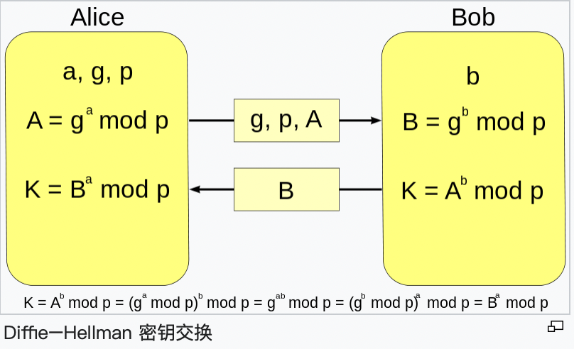

# Elgamal

## [CISCN2018]crackme-java【r爆破】

### 题目

```java
import java.math.BigInteger;
import java.util.Random;

public class crackme_java {
    static BigInteger two =new BigInteger("2");
    static BigInteger p = new BigInteger("11360738295177002998495384057893129964980131806509572927886675899422214174408333932150813939357279703161556767193621832795605708456628733877084015367497711");
    static BigInteger h= new BigInteger("7854998893567208831270627233155763658947405610938106998083991389307363085837028364154809577816577515021560985491707606165788274218742692875308216243966916");

    /*
     Alice write the below algorithm for encryption.
     The public key {p, h} is broadcasted to everyone.
    @param val: The plaintext to encrypt.
        We suppose val only contains lowercase letter {a-z} and numeric charactors, and is at most 256 charactors in length.
    */
    public static String pkEnc(String val){
        BigInteger[] ret = new BigInteger[2];
        BigInteger bVal=new BigInteger(val.toLowerCase(),36);
        BigInteger r =new BigInteger(new Random().nextInt()+"");
        ret[0]=two.modPow(r,p);
        ret[1]=h.modPow(r,p).multiply(bVal);
        return ret[0].toString(36)+"=="+ret[1].toString(36);
    }

    // Alice write the below algorithm for decryption. x is her private key, which she will never let you know.
    public static String skDec(String val,BigInteger x){
        if(!val.contains("==")){
            return null;
        }
        else {
            BigInteger val0=new BigInteger(val.split("==")[0],36);
            BigInteger val1=new BigInteger(val.split("==")[1],36);
            BigInteger s=val0.modPow(x,p).modInverse(p);
            return val1.multiply(s).mod(p).toString(36);
        }
    }
   

    public static void main(String[] args) throws Exception {
        System.out.println("You intercepted the following message, which is sent from Bob to Alice:");
        System.out.println("eag0vit7sboilgcfu0fbkbrmjgs4pzi2oznmqrkey5h1bwicvborngscx050u8vpghi69xqjmotgrtj4vq8fgw9tzi916o034bu==ahcwy7c0qq5cnxdntssqrj972nhvzt5liqlq0cvv0o1fm2ee4205nemuy5tvkda0hyetu5a5xcqqov8exk901z5xebvkcdo3jiq1gj8pkxzhjaeg9z6syu58neijxy56am7d1l9grhgtgkkfc432wm6h3jr8y1xx");
        System.out.println("Please figure out the plaintext!");
        
    }
}

//eag0vit7sboilgcfu0fbkbrmjgs4pzi2oznmqrkey5h1bwicvborngscx050u8vpghi69xqjmotgrtj4vq8fgw9tzi916o034bu==ahcwy7c0qq5cnxdntssqrj972nhvzt5liqlq0cvv0o1fm2ee4205nemuy5tvkda0hyetu5a5xcqqov8exk901z5xebvkcdo3jiq1gj8pkxzhjaeg9z6syu58neijxy56am7d1l9grhgtgkkfc432wm6h3jr8y1xx
```


### 解法

ELGamal算法

加密过程

Alice选取随机数r, g为2， 同时将明文val全部转换为小写字母并转换为36进制 bval。

加密得到密文ret[0]（y1）, ret[1] (y2)
$$
Ek（m,r)=(y1,y2)
\\ y1 = 2^r mod \ p
\\ y2 = (h^r \ mod \ p) *M
$$
解密，其中x为私钥，我们是不知道的
$$
s = (y1^x \ mod \ p)^{-1} mod \ p
\\ M = (y2 * s) mod \ p
$$
但是可以发现h,p,y1,y2都是已知的，只有r是未知的，知道r明文可以表示为
$$
M = y2 /pow(h,r,p)
$$
而r是int范围内的随机数，共32位，所以可以直接爆破

多线程爆破

32个线程，每个从i * 2^26到(i+1) * 2^26

```python
from threading import Thread

p=11360738295177002998495384057893129964980131806509572927886675899422214174408333932150813939357279703161556767193621832795605708456628733877084015367497711
c1=int('a9hgrei38ez78hl2kkd6nvookaodyidgti7d9mbvctx3jjniezhlxs1b1xz9m0dzcexwiyhi4nhvazhhj8dwb91e7lbbxa4ieco',36)

def calr(r0,pid):
    print("[Process%d]: start from %d" % (pid, r0))
    while r0 < 2**26*(pid+1):
        if pow(2,r0,p) == c1:
            f = open('r','w')
            f.write(r0)
            exit(0)
        r0+=1
        if r0 % 2**18 == 0:
            print('[Process%d]: now %d' % (pid, r0))
    print('[Process%d]: exited!' % pid)

for i in range(0,32):
    t = Thread(target=calr,args=(i*2**26,i))
    t.start()

```

得到r为152351913

base36实现十进制转36进制（base36.dumps(c2//pow(h,r,p))	


# 协商协议

## uvw77ay_aiffip【diffle-hellman】

### 题目

小明听说某软件会自动备份自己的聊天记录，非常恼火，一怒之下设计了个超级基础协商协议。某天他准备和你通讯，发给你了一段协商消息，附件中还有公用生成元g和你的私钥，以及保证密钥长度的质数。那么，你们的最后协商的32位密钥是啥呢？（题目标题有玄机，答案为32位的十进制数）

### 解法

虽然说设计，应该不至于凭空产生（

所以多半和已有的协商协议类似，先找下大概有哪些，发现最符合的还是diffle-hellman（虽然还是不明白这标题到底有什么提示）



根据这个

小明发的g^a mod p = K (57687185873717832710418532982088)

然后我们只需要知道K^b mod p  = 37799067929880674766269861874334即为最后的密钥

