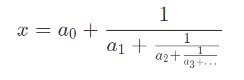
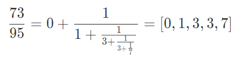
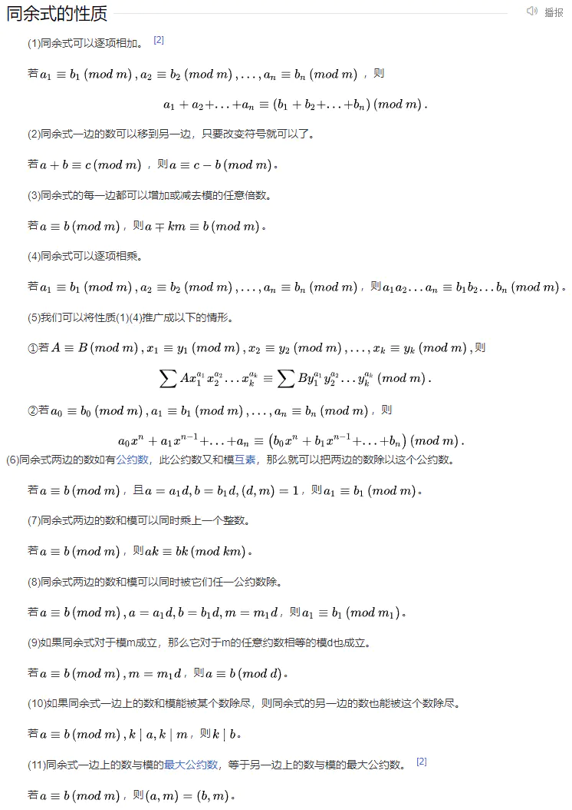
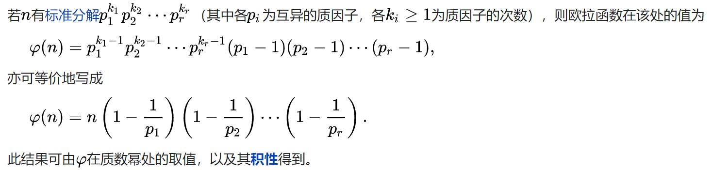
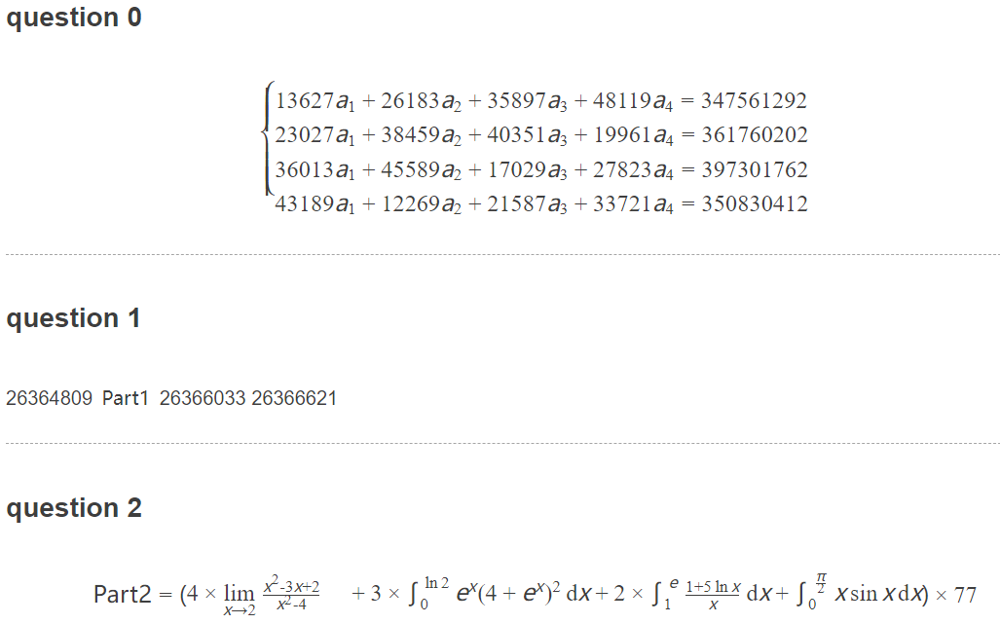
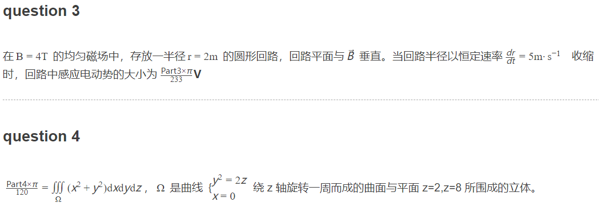
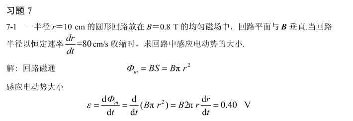
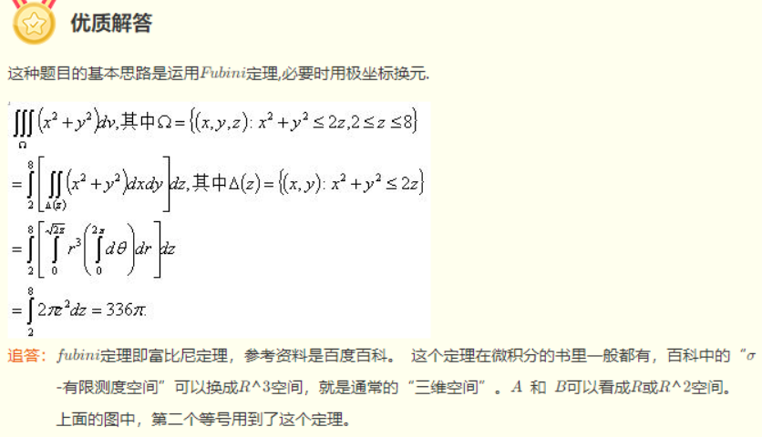

# 基础知识

## 连分数

数x表示为如下形式



可以
$$
x=[a 
0
​
 ,a 
1
​
 ,a 
2
​
 ,a 
3
​
 ,…,a 
n
​
 ]
$$
例子：



```python
        def continuedfra(x,y):
            cf = []
            while y:
                cf += [x//y]
                x,y = y,x%y
            return cf

        n = continuedfra(73,95)
        print(n)
```


## 离散对数

n1=p1q1，则ord(p1)=q1，因为
$$
p1^x mod n 
$$
的值只有q1种结果

## 数论

### 同余



### 欧拉定理


$$
m^{p-1} = 1 mod p (p为素数)
$$

### 欧拉函数



### 欧拉准则

给定非零n，**奇素数p**

n有一个平方根（二次余数）当且仅当
$$
n^{p-1/2} = 1 (mod\ p)
$$
若n没有平方根
$$
n^{p-1/2} = -1 (mod\ p)
$$

可以通过此判断n是否为p的二次剩余

### 欧几里得算法


### 扩展欧几里得


### 中国剩余定理


### 指数循环节


## 抽象代数


# 题目

## [CISCN]puzzle【】

### 题目





### 解法

是真的不能再绝了（ ~~`sos`~~

#### question 0 【方程组】

解方程即可

```python
x = sympy.Symbol('x')
y = sympy.Symbol("y")
z = sympy.Symbol("z")
m = sympy.Symbol("m")

solved_value = sympy.solve([13627*x + 26183*y + 35897*z + 48119*m -347561292 ,
                            23027*x + 38459*y + 40351*z + 19961*m -361760202,
                            36013*x + 45589*y + 17029*z + 27823*m -397301762,
                            43189*x + 12269*y + 21587*z + 33721*m -350830412], [x,y,z,m])
print(solved_value)

```

得到{x: 4006, y: 3053, z: 2503, m: 2560}

fa6bed9c7a00

#### question 1【找规律】

刚开始还以为会有等差数列什么的（

但是发现不对，再发现好像都是素数（ctf 密码也经常接触素数，应该就是相邻的素数

26365399 (0x1924dd7)

#### question 2【极限、积分】

```python
# 极限
x = sympy.Symbol('x')
f = (x**2 -3*x + 2)/(x**2-4)
print(sympy.limit(f,x,2))

# 积分
f = sympy.exp(x)*(4+sympy.exp(x))**2
print(sympy.integrate(f,(x,0,sympy.ln(2))))

f2 = (1 + 5*sympy.ln(x))/x
print(sympy.integrate(f2,(x,1,sympy.exp(1))))

f3 = x*sympy.sin(x)
print(sympy.integrate(f3,(x,0,sympy.pi/2)))
```


#### question 3【电磁感应】



18640 (0x48d0)

#### question 4【fubini定理】


https://www.zybang.com/question/aed760f3251be1a87a2ab0d2069eb295.htmlhttps://www.zybang.com/question/aed760f3251be1a87a2ab0d2069eb295.html

40320 (0x9d80)


## [GKCTF2021]XOR【dfs，x+n+len->a,b】

### 题目

已知奇数相乘与异或的结果

```python
a = getPrime(512)
b = getPrime(512)
c = getPrime(512)
d = getPrime(512)
d1 = int(bin(d)[2:][::-1] , 2)
n1 = a*b
x1 = a^b
n2 = c*d
x2 = c^d1
flag = md5(str(a+b+c+d).encode()).hexdigest()
```


### 解法

已知a，b都为512位的奇数，现已知其积n1，异或结果x1，需要求a，b的值

所以只需要不断枚举它的每一位就可以了。但是每位有0，1两种结果，512位就有2^512种可能，显然爆破是不太现实的。

不过有这样一个同余的性质：不论在几进制下，如果已知A,B两个数的最后n位，那么它们的乘积的最后n位我们也会知道了。

例如：

**9**×**7**=6**3**，53370**9**×18826**7**=10047979230**3**。

十六进制这种情况也同样存在：

7ABH×96FH=485625H，8733**7AB**H×62CEH**96F**H=342ED01B03C**625**H


所以我们需要逐位根据条件得到可能的（a,b）对，每次更新a和b的表，主要根据以下两个条件：

1. 新的aa和bb符合异或结果，即
   $$
   aa\ xor \ bb == x1 \ mod \ 2^{round}
   $$
   
2. 乘积与n1的后round位相同，即
   $$
   aa * bb \ mod \  2^{round} == n1 \ mod \ 2^{round}
   $$

重复上述步骤，只需要n（512）次即可找到

然后依次判断a,b是否满足条件，即乘积是否为n1

```python
# DFS，已知a，b的积n，异或结果x，求a，b。 len为a，b的比特位
def dfs(n,x,len):
    a_list, b_list = [0], [0]

    round = 1
    for i in range(len):  # 已知a和b的低n(512)位的异或结果
        round *= 2
        nxt_as, nxt_bs = [], []
        for al, bl in zip(a_list, b_list):
            for ah, bh in itertools.product([0, 1], repeat=2):
                aa, bb = ah * (round // 2) + al, bh * (round // 2) + bl
                if ((aa * bb % round == n % round) and ((aa ^ bb) == x % round)):
                    nxt_as.append(aa)
                    nxt_bs.append(bb)

        a_list, b_list = nxt_as, nxt_bs

    for a, b in zip(a_list, b_list):
        if (a * b == n):
            break

    print(a)
    print(b)
    return a,b

```

递归版本 https://huangx607087.online/2021/07/12/GKCTF2021-WriteUp/#toc-heading-8


求c，d同理，但是题目已知的是d的二进制倒序d1 与 c异或的结果x2

因此爆破时，同时爆破4个位，即c、d的高位c_high_bit、d_high_bit，c、d的低位c_low_bit、d_low_bit 。此时验证条件改为：

（1）c_low_bit ^ d_high_bit == x2_low_bit

（2）c_high_bit ^ d_low_bit == x2_high_bit

（3）(c_low_bit[:-i] * d_low_bit[:-i]) mod (2^i )== n2_low_bit mod (2^i )

（4）(c_high_bits + c_low_bits) * (d_high_bits + d_low_bits ) <= n2

（5）(c_high_bits + c_low_bits + 中间位全1) * (d_high_bits + d_low_bits + 中间位全1) >= n2

```python
def dfs2(x,n,len):
    a_list, b_list, aa_list, bb_list = [0], [0], [0], [0]

    x1_bits = [int(x) for x in f'{x:0512b}'[::-1]]

    cur_mod = 1
    for i in range(len//2):  # 分别从高位和低位 逐位更新，所以只需要n/2次
        cur_mod *= 2
        nxt_as, nxt_bs, nxt_aas, nxt_bbs = [], [], [], []
        for al, bl, a2, b2 in zip(a_list, b_list, aa_list, bb_list):
            for ah, bh, ah2, bh2 in itertools.product([0, 1], repeat=4):
                aa, bb, aa2, bb2 = ah * (cur_mod // 2) + al, bh * (cur_mod // 2) + bl, ah2 * (cur_mod // 2) + a2, bh2 * (
                            cur_mod // 2) + b2
                bb2_rev = f'{bb2:0512b}'[::-1]
                bb2_rev = int(bb2_rev, 2)
                aa2_rev = f'{aa2:0512b}'[::-1]
                aa2_rev = int(aa2_rev, 2)

                gujie = '0' * (i + 1) + '1' * (510 - 2 * i) + '0' * (i + 1)
                gujie = int(gujie, 2)
                if ((aa * bb % cur_mod == n % cur_mod) and ((ah ^ bh2) == x1_bits[i]) and (
                        ah2 ^ bh == x1_bits[511 - i]) and ((aa2_rev + aa) * (bb2_rev + bb) <= n) and (
                        (aa2_rev + aa + gujie) * (bb2_rev + bb + gujie) >= n)):
                    nxt_as.append(aa)
                    nxt_bs.append(bb)
                    nxt_aas.append(aa2)
                    nxt_bbs.append(bb2)

        a_list, b_list, aa_list, bb_list = nxt_as, nxt_bs, nxt_aas, nxt_bbs

    for a, b, aa2, bb2 in zip(a_list, b_list, aa_list, bb_list):
        aa2_rev = f'{aa2:0512b}'[::-1]
        aa2_rev = int(aa2_rev, 2)
        bb2_rev = f'{bb2:0512b}'[::-1]
        bb2_rev = int(bb2_rev, 2)
        a = aa2_rev + a
        b = bb2_rev + b
        if (a * b == n):
            break

    print(a)
    print(b)
    print(a*b==n)
    return a,b
```


## [羊城杯2020]GMC【二次剩余】

### 题目

```python
def gmc(a, p):
    if pow(a, (p-1)//2, p) == 1:
        return 1
    else:
        return -1


def gen_key():
    [gp,gq] = [getPrime(512) for i in range(2)]
    gN = gp * gq
    return gN, gq, gp


def gen_x(gq,gp):
    while True:
        x = getRandomNBitInteger(512)
        if gmc(x,gp) ^ gmc(x,gq) == -2:
            return x


def gen_y(gN):
    gy_list = []
    while len(gy_list) != F_LEN:
        ty = getRandomNBitInteger(768)
        if gcd(ty,gN) == 1:
            gy_list.append(ty)
    return gy_list


if __name__ == '__main__':

    flag = bin(bytes_to_long(flag))[2:] 
    F_LEN = len(flag)
    N, q, p = gen_key()
    x = gen_x(q, p)
    y_list = gen_y(N)
    ciphertext = []

    for i in range(F_LEN):
        tc = pow(y_list[i],2) * pow(x,int(flag[i])) % N
        ciphertext.append(tc)

    with open('./output.txt','w') as f:
        f.write(str(N) + '\n')
        for i in range(F_LEN):
            f.write(str(ciphertext[i]) + '\n')
```

### 解法

已知量：N,ciphertext[i] (F_LEN=303)

未知量：x(512),y(768)

目标：flag，**看掉了加密用到的flag为二进制值！！！**

ciphertext[i]与flag[i]有关,tc = pow(y[i],2)*pow(x,int(flag[i])) % N。

x(512位的素数)满足条件：gmc(x,p)与gmc(x,q)一个结果为1，一个为-1，即是p，q其中一个的二次剩余，另一个不是，因此一定不是N的二次剩余

y与n互素(那么与p，q互素），随机生成的303个y，pow(y[i],2)一定为N的二次剩余


flag[i]只有0，1两种情况，那么就是是否乘以x的区别

所以可以计算 ciphertext[i] mod N的雅可比符号，如果为-1，那么可以确定是乘了x的，即flag[i]为1，否则即为0

可以直接用gmpy2.jacobi求雅可比符号

```python
N = 148760420796347282647913911627776948830239814743638812709731776000466100207777162738977240539627777504862891520483027225844332857730318919289377255562015896033182654334542973602513418626645338991446207189808474719558585195954666433739246138613004129695152347138574660937725372179703937058850684223201586238273
flag = ''
with open('output.txt','r') as f:
    lines = f.readlines()
    for line in lines:
        cipher = int(line)
        if gmpy2.jacobi(cipher,N) == -1:
            flag += '1'
        else:
            flag += '0'
    print(long_to_bytes(int(flag,2)))
```

