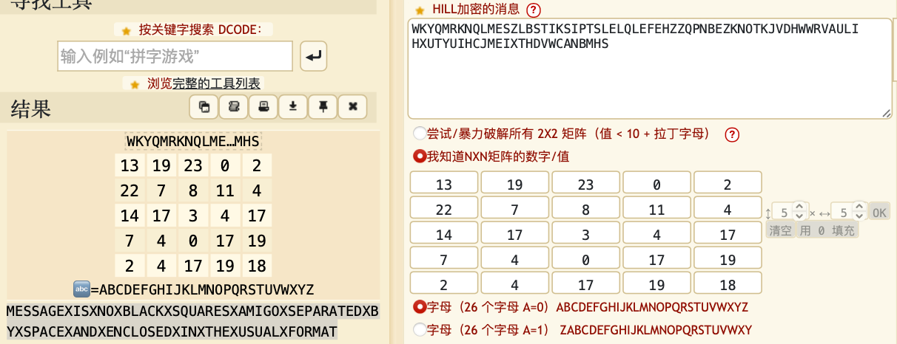

## [Zer0pts2020]ROR

### 题目

```python
import random
from secret import flag

ror = lambda x, l, b: (x >> l) | ((x & ((1<<l)-1)) << (b-l))  #循环右移

N = 1
for base in [2, 3, 7]:
    N *= pow(base, random.randint(123, 456))  # 2^n*3^n*7^n
e = random.randint(271828, 314159)

m = int.from_bytes(flag, byteorder='big')
assert m.bit_length() < N.bit_length()

for i in range(m.bit_length()):
    print(pow(ror(m, i, m.bit_length()), e, N))


```

### 解法

N是个2的倍数，而一个数如果对一个偶数取模，那么其奇偶性不变。而乘方运算是不改变一个数字的奇偶性的。所以这道题给出的数字中，每个数字都泄露了明文的最后一个比特位，拼接起来就是flag

```python
with open("chall.txt",'r') as f:
    m = f.readlines()

flag = ""
for i in range(len(m)):
    m[i] = m[i].strip("\n")
    flag += bin(int(m[i]))[-1]

print(long_to_bytes(int(flag,2)))
print(long_to_bytes(int(flag[::-1],2)))
```


# [b01lers2020]crypto_crossword

## 题目

```
Crypto-crossword   (by a0su, maczilla, dm)
----------------

Can use use the clues to decode the flag?


     1   2   3   4   5
   +---+---+---+---+---+  }
   |   |   |   |   |   |  |   
   |---+---+---+---+---|  |     
 6 |   |   |   |   |   |  |
   |---+---+---+---+---|  \
 7 |   |   |   |   |   |   -> WKYQMRKNQLMESZLBSTIKSIPTSLELQLEFEHZZQPNBEZKNOTKJVDHWWRVAULIHXUTYUIHCJMEIXTHDVWCANBMHS
   |---+---+---+---+---|  /   
 8 |   |   |   |   |   |  |
   |---+---+---+---+---|  |
 9 |   |   |   |   |   |  |
   +---+---+---+---+---+  }

 
 1: ;fH;aCh7-"@UWb^G@>N&F#kFRDf'?"DIal3D]iJ!C3=T>+EqL-F<G%(Ci=3(F!,RC+EqL;D'3b7+B;0.==s

 2: GUR FZNYYRFG EFN RKCBARAG RIRE VA JVQRFCERNQ HFR.

 3: 4261636b77617264733a2074776f20666f722062696e6172792c2074656e20666f7220646563696d616c2c20616e64
    207369787465656e20666f72206865782e20

 4: KLHHRYOB GSV URIHG QZEZHXIRKG UFMXGRLM BLF VEVI XZOOVW.

 5: Ecceilnort cdemnostu ahtt eoprv ehinoprsw fo ,eksy cddeeru ot efiv .eelrstt

 6: FRPPRQ UHVHUYHG ZRUG LQ F++ DQG SBWKRQ.

 7: TW9kZXJuIGNyeXB0byBlc3BlY2lhbGx5IGxpa2VzIGdyb3VwcyBvZiBwcmltZSBfX19fXy4=

 8: ooOo00oo0oOo0ooo0O0000oooo0oO0oOoo0ooOo0000OOO0ooOo0000oO0000ooOo0oO0OO0OOO0ooO0ooo0000OOO0oOO
    o0o0Oo0ooo0ooo0oOoo0000oooO0ooO0oOoo0Oo0o0oOo0oO0Oooo00oo0oOoo00oo0O0OoOO0oOoOoO0

 9: 7x4 2x1 6x1 3x2 # 2x1 7x4 # 2x1 6x2 7x4 9x1 3x2 7x3 # 6x2 8x2 6x1 2x2 3x2 7x3 # 3x3 4x3 8x3 3x2 
    1x1

```

## 解法

一个5*5的矩阵和加密后的flag，可能是希尔密码

1. Base85: Spelled backwards: command to adjust what belongs to whom on UNIX.

   命令是chown，倒过来写应该是nwohc

2. Quipquip: the smallest rsa exponent ever in widespread use 

   (最常用的还是3(three), e=2则为rabin算法)

3. 十六进制转换后得到 Backwards: two for binary, ten for decimal, and sixteen for hex. 

   指“base”，但是它只有四位，用同义词radix代替，倒过来写应该是xidar

4. Quipquip:  possibly the first javascript function you ever called(alert?)

5. https://www.dcode.fr/shuffled-letters 硬试 ： Electronic documents that prove ownership of ,keys reduced to five .letters（certs)
6. Quip quip: common reserved word in c++ and function(while)

7. Base64: Modern crypto especially likes groups of prime _____. (Order)
8. 只有三个字符，没找到其他的，考虑morse https://www.dcode.fr/morse-code FIRST HALF OF A FAMOUS OPENSSL VULNERABILITY.（heartbleed,取heart）
9. 手机键盘密码！（没有大于9的）九宫格 same as answer number five(certs)

将对应线索分别填入矩阵中

解密得到，分开还得小写。。。

MESSAGEXISXNOXBLACKXSQUARESXAMIGOXSEPARATEDXBYXSPACEXANDXENCLOSEDXINXTHEXUSUALXFORMAT



http://blog.neargle.com/SecNewsBak/drops/CTF中那些脑洞大开的编码和加密%20.html
